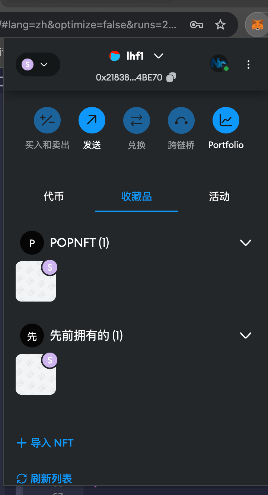
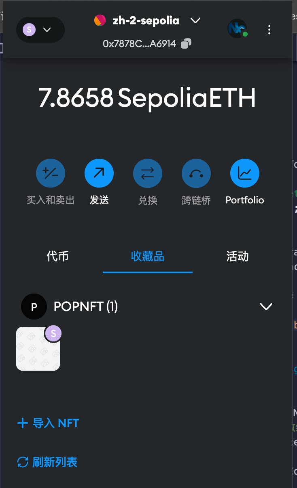

# Sample Hardhat Project

// 该hardhat 测试用例正常跑，部署异常
// 最后使用remix进行合约部署并进行测试

```shell
npm run compile
npm run test
npm run deploy:sepolia
```

最终合约相关地址：
ERC20 - MyToken: 0x4e5623b716081424e6f645b56ec05cad1b499af0
ERC721 - MyNFTToken: 0xd069460acf2daba36c3b740934514ae1fc962441
NFTMarket - NFTMarket: 0xf0ab8066330e181be5359f0740cb2182e7608045

上架NFT交易哈希: 0xc47ee1ba4bf948df51ac924964273dd5da3636ddb6c247b00b8a6662ac4e8835
购买NFT交易哈希：0xefcd744c33223e648ba8a9684740ec50e1cc29ef7ace71898511288233bdf46f



