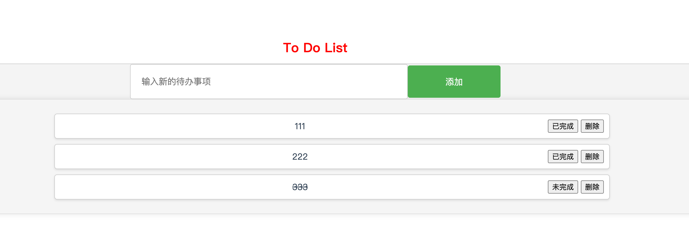

# react todoList

## 实操

```shell
Web3-Frontend-Bootcamp/members/qiaopengjun5162/task1 on  main via 🅒 base 
➜ pnpm create vite
.../18fe3dc26f4-a757                     |   +1 +
.../18fe3dc26f4-a757                     | Progress: resolved 1, reused 0, downloaded 1, added 1, done
✔ Project name: … react-to-do-list
✔ Select a framework: › React
✔ Select a variant: › TypeScript

Scaffolding project in /Users/qiaopengjun/Code/react/Web3-Frontend-Bootcamp/members/qiaopengjun5162/task1/react-to-do-list...

Done. Now run:

  cd react-to-do-list
  pnpm install
  pnpm run dev


Web3-Frontend-Bootcamp/members/qiaopengjun5162/task1 on  main [?] via 🅒 base took 5m 27.0s 
➜   cd react-to-do-list

Web3-Frontend-Bootcamp/members/qiaopengjun5162/task1/react-to-do-list on  main [?] via ⬢ v22.1.0 via 🅒 base 
➜  pnpm install

   ╭─────────────────────────────────────────────────────────────────╮
   │                                                                 │
   │                Update available! 9.1.2 → 9.1.4.                 │
   │   Changelog: https://github.com/pnpm/pnpm/releases/tag/v9.1.4   │
   │                Run "pnpm add -g pnpm" to update.                │
   │                                                                 │
   │     Follow @pnpmjs for updates: https://twitter.com/pnpmjs      │
   │                                                                 │
   ╰─────────────────────────────────────────────────────────────────╯

 WARN  3 deprecated subdependencies found: glob@7.2.3, inflight@1.0.6, rimraf@3.0.2
Packages: +206
+++++++++++++++++++++++++++++++++++++++++++++++++++++++++++++++++++++++++++++++++++++++++++++++++++
Progress: resolved 243, reused 183, downloaded 23, added 206, done
node_modules/.pnpm/esbuild@0.20.2/node_modules/esbuild: Running postinstall script, done in 66ms

dependencies:
+ react 18.3.1
+ react-dom 18.3.1

devDependencies:
+ @types/react 18.3.3
+ @types/react-dom 18.3.0
+ @typescript-eslint/eslint-plugin 7.12.0
+ @typescript-eslint/parser 7.12.0
+ @vitejs/plugin-react 4.3.0
+ eslint 8.57.0 (9.4.0 is available)
+ eslint-plugin-react-hooks 4.6.2
+ eslint-plugin-react-refresh 0.4.7
+ typescript 5.4.5
+ vite 5.2.12

Done in 16.3s

Web3-Frontend-Bootcamp/members/qiaopengjun5162/task1/react-to-do-list on  main [?] via ⬢ v22.1.0 via 🅒 base took 16.5s 
➜ pnpm run dev

> react-to-do-list@0.0.0 dev /Users/qiaopengjun/Code/react/Web3-Frontend-Bootcamp/members/qiaopengjun5162/task1/react-to-do-list
> vite


  VITE v5.2.12  ready in 127 ms

  ➜  Local:   http://localhost:5173/
  ➜  Network: use --host to expose
  ➜  press h + enter to show help

pnpm add sass -D
npm install -D tailwindcss postcss autoprefixer
npx tailwindcss init -p
pnpm add prop-types 
pnpm add @types/prop-types --save-dev
pnpm add uuid    
pnpm add --save-dev @types/uuid  
pnpm add less      
```

## 参考

- <https://v4.vitejs.dev/guide/>
- <https://react.dev/>


