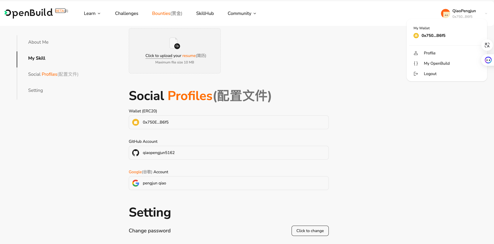

# Task2 Blockchain Basic

本任务分为简答题、分析题和选择题，以此为模板，在下方填写你的答案即可。

选择题，请在你选中的项目中，将 `[ ]` 改为 `[x]` 即可

## [单选题] 如果你莫名奇妙收到了一个 NFT，那么

- [ ] 天上掉米，我应该马上点开他的链接
- [x] 这可能是在对我进行诈骗！

## [单选题] 群里大哥给我发的网站，说能赚大米，我应该

- [ ] 赶紧冲啊，待会米被人抢了
- [x] 谨慎判断，不在不信任的网站链接钱包

## [单选题] 下列说法正确的是

- [x] 一个私钥对应一个地址
- [ ] 一个私钥对应多个地址
- [ ] 多个私钥对应一个地址
- [ ] 多个私钥对应多个地址

## [单选题] 下列哪个是以太坊虚拟机的简称

- [ ] CLR
- [x] EVM
- [ ] JVM

## [单选题] 以下哪个是以太坊上正确的地址格式？

- [ ] 1A4BHoT2sXFuHsyL6bnTcD1m6AP9C5uyT1
- [ ] TEEuMMSc6zPJD36gfjBAR2GmqT6Tu1Rcut
- [ ] 0x997fd71a4cf5d214009619808176b947aec122890a7fcee02e78e329596c94ba
- [x] 0xf39Fd6e51aad88F6F4ce6aB8827279cffFb92266

## [多选题] 有一天某个大哥说要按市场价的 80% 出油给你，有可能

- [x] 他在洗米
- [ ] 他良心发现
- [x] 要给我黒米
- [x] 给我下套呢

## [多选题] 以下哪些是以太坊的二层扩容方案？

- [ ] Lightning Network（闪电网络）
- [x] Optimsitic Rollup
- [x] Zk Rollup

## [简答题] 简述区块链的网络结构

```
区块链的网络结构是一个分布式的对等网络（P2P网络），没有中心化的服务器或控制节点。
区块链网络中的节点之间通过 P2P 协议进行通信，每个节点都扮演着网络中的一个角色，即节点。
区块链的网络结构是一种去中心化的网络结构，它的特点是分布式、不可篡改、安全可信。以下是简要的概述：

1. **去中心化**：
   - 区块链网络是去中心化的，没有单一的控制机构或管理者。相反，网络由多个节点组成，这些节点共同维护和管理网络的数据和状态。

2. **节点**：
   - 区块链网络中的参与者被称为节点。节点可以是个人用户、矿工、开发者或机构等。节点之间通过网络进行通信和交互。

3. **分布式账本**：
   - 区块链网络使用分布式账本技术，即所有参与者共享同一份数据副本，而不是依赖于中心化的数据库。每个节点都有完整的账本副本，并可以对其进行更新和验证。

4. **共识机制**：
   - 区块链网络通过共识机制来确保所有节点之间的一致性和安全性。常见的共识机制包括工作量证明（Proof of Work，PoW）、权益证明（Proof of Stake，PoS）、权益证明+权益抵押（Proof of Stake + Proof of Stake，PoS+PoW）等。

5. **区块链协议**：
   - 区块链网络使用特定的协议来实现数据的验证、传输和存储。这些协议定义了节点之间的通信规则和数据交换方式，确保网络的正常运行。

6. **网络层级**：
   - 区块链网络通常由多个层级组成，包括底层网络协议、共识层、数据存储层等。不同的层级负责处理不同的功能和任务，从而构建出完整的区块链系统。

总的来说，区块链的网络结构是由去中心化的节点组成的分布式网络，通过共识机制和协议来确保数据的一致性和安全性，从而实现可信的去中心化应用。
```

## [简答题] 智能合约是什么，有何作用？

```
智能合约是在区块链上运行的确定性程序。
其代码逻辑是：“如果发生事件x，则执行任务y”。
然而，智能合约无法自动执行，也就是说，合约必须要被一笔链上交易触发才能运行，并在链上发起状态变更。这笔外部交易的作用是“唤醒”智能合约，并触发合约逻辑。这就好像你得用鼠标点击桌面上的图标才能启动程序一样。

智能合约是存储在区块链上的数字合约，在满足预先确定的条款和条件时会自动执行这些合约。
智能合约，就是一种运行在区块链上的程序。，智能合约有很多限制。
智能合约的作用是：
确保在区块链上执行的交易都是合法的、可预测的、可验证的。
能够实现高度自动化、去中心化和透明的操作，减少人为干预和中介成本。
```

## [简答题] 怎么理解大家常说的 `EVM` 这个词汇？

```
"EVM" 是以太坊虚拟机（Ethereum Virtual Machine）的缩写，它是以太坊区块链系统的核心组件之一。理解 EVM 需要从以下几个方面入手：

1. **虚拟机**：EVM 是一个基于栈的虚拟机，类似于计算机的虚拟机，但是运行在以太坊区块链上。它可以执行以太坊上的智能合约代码，并将结果保存在区块链上。

2. **智能合约执行**：EVM 负责执行以太坊网络上的智能合约。当用户发送交易调用智能合约时，EVM 将执行合约中的代码，并返回执行结果。这使得以太坊能够实现自动化的、去中心化的智能合约功能。

3. **字节码**：智能合约在以太坊上以字节码的形式存储和执行。开发者使用高级编程语言（如 Solidity）编写智能合约，然后将其编译成 EVM 可执行的字节码。EVM 能够理解和执行这些字节码指令。

4. **状态转换**：EVM 负责管理以太坊的状态转换。当智能合约被执行时，EVM 将读取和修改区块链上的状态（包括账户余额、智能合约状态等），并在必要时更新到区块链上。

5. **安全性和确定性**：EVM 的设计旨在确保智能合约的安全性和确定性。它采用严格的隔离和沙盒机制，以防止智能合约之间的相互影响，并保证相同的智能合约在不同节点上执行的结果是一致的。

总的来说，EVM 是以太坊区块链系统中的核心组件，负责执行智能合约和管理状态转换，是实现以太坊智能合约功能的基础。
```

## [分析题] 你对去中心化的理解

```
去中心化是一种组织或系统结构的设计理念，其核心思想是将权力、控制和决策权分散到系统的各个参与者之间，而不是集中在单一的中心化实体或机构手中。在去中心化的系统中，参与者之间通过协议、协作和共识机制来进行交互和决策，而无需依赖于中心化的控制或调节。

以下是对去中心化的理解：

1. **权力分散**：去中心化系统不依赖于单一的中心化权威机构或个人，而是由多个节点或参与者共同管理和控制。这种分散的权力结构能够减少单点故障和单点攻击的风险，提高系统的安全性和韧性。

2. **自治和民主**：去中心化系统通常采用自治和民主的决策机制，所有参与者都有权利参与到系统的决策过程中，并通过共识达成共同的决策。这种民主化的机制可以保障系统的公平性和透明度。

3. **信任和透明**：由于去中心化系统的运行不依赖于单一的中心化实体，参与者之间需要通过协议和共识机制来建立信任和达成共识。去中心化系统通常具有更高的透明度和可验证性，所有参与者都可以查看和验证系统的运行情况。

4. **抗审查和自由**：去中心化系统具有抗审查和自由的特性，参与者可以自由地参与到系统中，无论其身份或地理位置如何。这种去中心化的结构可以防止政府或其他中心化机构对系统进行审查或干预，保障用户的权利和隐私。

总的来说，去中心化是一种新型的组织和系统结构设计理念，其核心是将权力和控制分散到系统的各个参与者之间，从而实现更加公平、安全、透明和自由的运行方式。去中心化系统在加密货币、区块链、分布式网络等领域得到了广泛的应用和发展。
```

## [分析题] 比较区块链与传统数据库，你的看法？

```
区块链与传统数据库在设计理念、特点和适用场景上存在显著的差异。以下是我对两者的比较看法：

1. **中心化 vs. 去中心化**:
   - 传统数据库通常是中心化的，由单一的管理者或实体控制和管理数据存储和访问权限。而区块链是去中心化的，数据存储和控制权分散到网络中的多个节点上，无需信任中心化的实体。
   
2. **可修改性 vs. 不可篡改性**:
   - 传统数据库中的数据可以被授权的管理员修改或删除，因此具有一定的可修改性。而区块链上的数据是不可篡改的，一旦记录到区块链上，就无法修改或删除，确保了数据的可信度和安全性。
   
3. **权限控制 vs. 公开透明**:
   - 传统数据库可以通过访问控制列表（ACL）等机制对数据的访问进行精细化控制，而区块链上的数据通常是公开透明的，任何人都可以查看和验证数据，确保了数据的公开和透明性。
   
4. **性能 vs.安全性**:
   - 传统数据库通常具有较高的性能和吞吐量，适用于需要高效处理大量数据的场景。而区块链由于去中心化和不可篡改性等特性，性能较传统数据库相对较低，但提供了更高的安全性和可信度。
   
5. **适用场景**:
   - 传统数据库适用于需要高效处理数据的中心化场景，如企业内部的数据管理、金融交易、电子商务等。而区块链适用于需要公开透明、不可篡改、去中心化的场景，如加密货币、智能合约、供应链管理等。

综上所述，区块链和传统数据库各有其优势和适用场景。传统数据库适用于需要高效处理数据的中心化场景，而区块链适用于需要公开透明、不可篡改、去中心化的场景。在实际应用中，可以根据具体的业务需求和场景特点选择合适的数据库技术。
```

## 操作题

安装一个 WEB3 钱包，创建账户后与 [openbuild.xyz](https://openbuild.xyz/profile) 进行绑定，截图后文件命名为 `./bind-wallet.jpg`.

