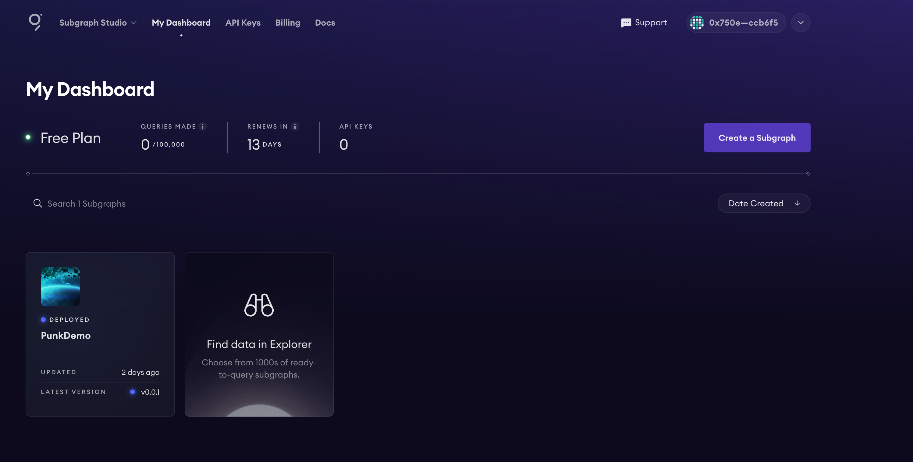
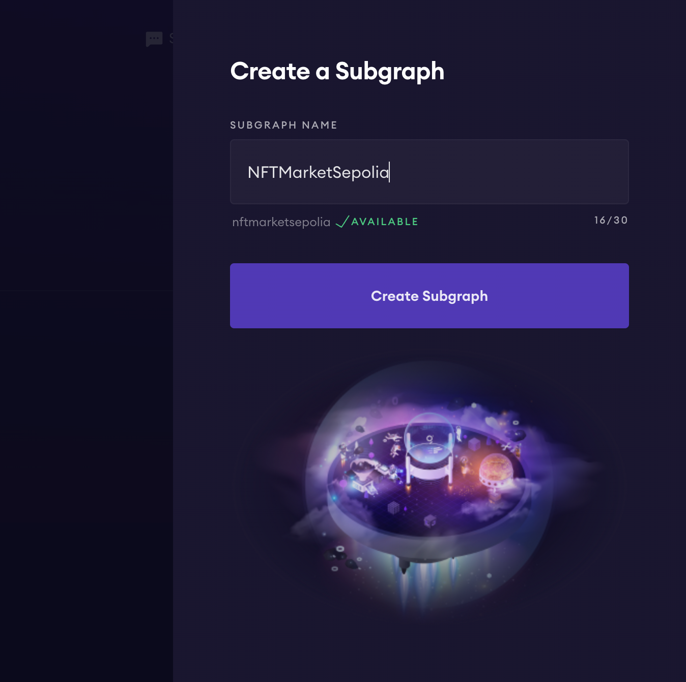
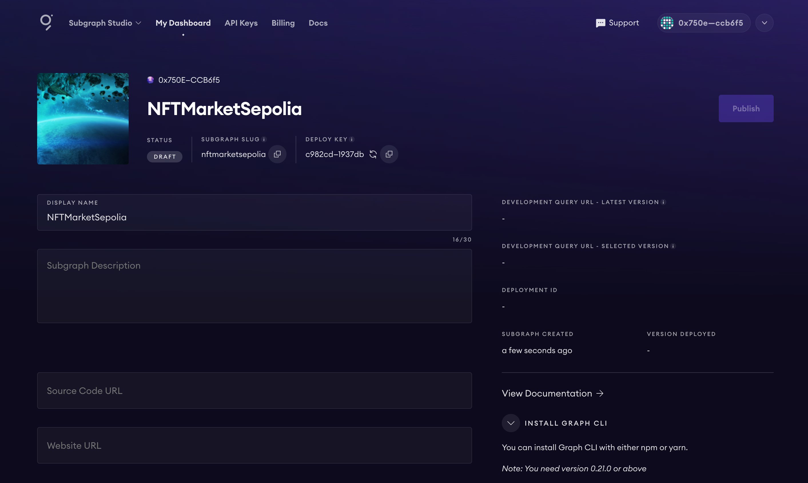
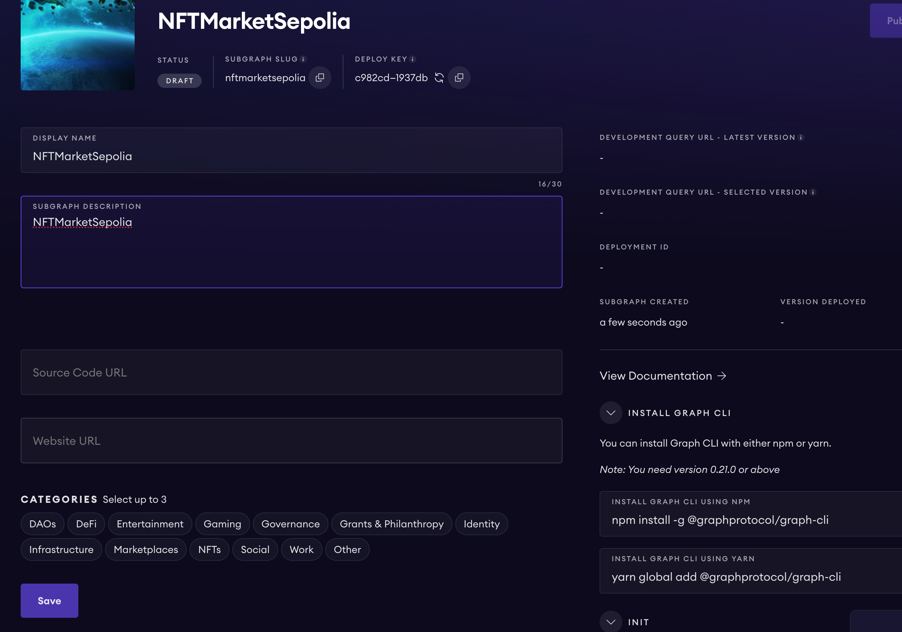
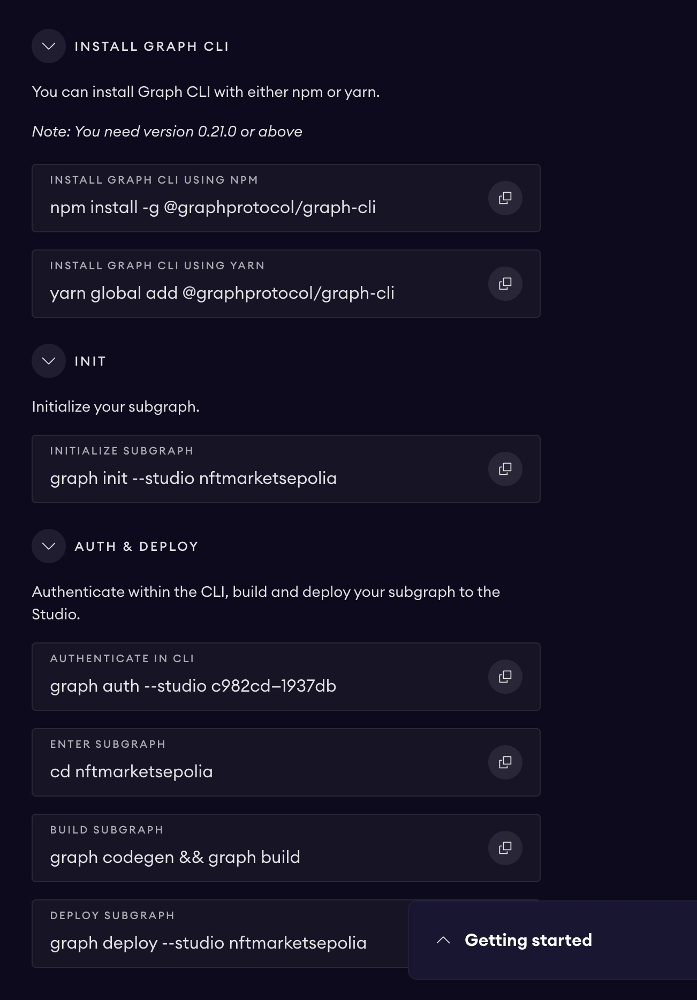
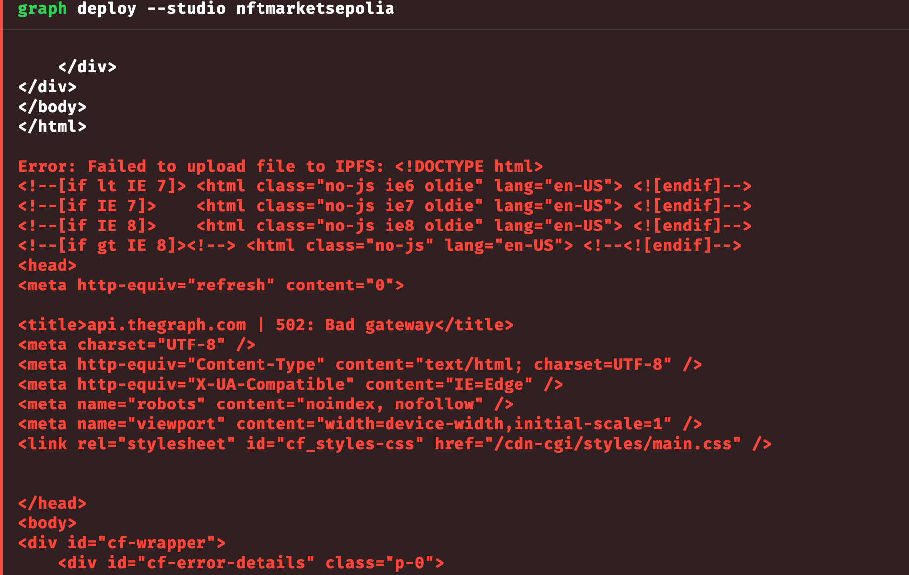
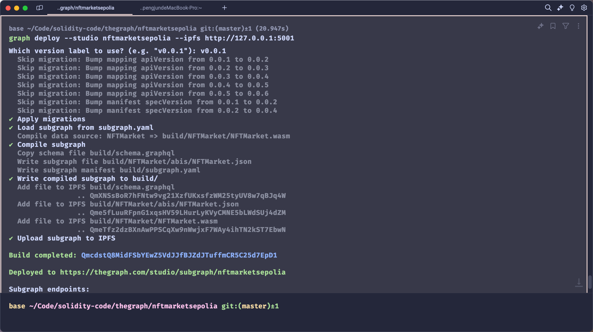
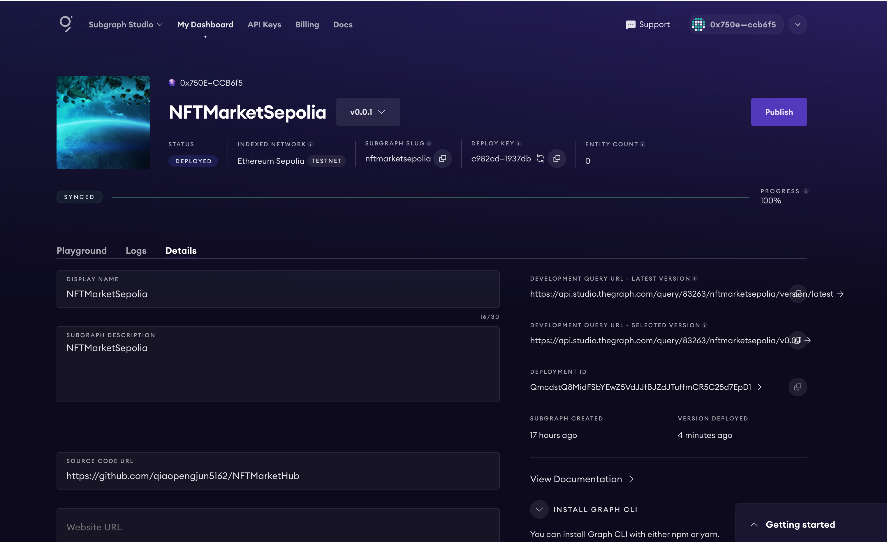

# 为NFTMarket创建一个The Graph子图


点击




创建子图



创建后



填写描述信息



按照步骤进行




```shell
graph init --studio nftmarketsepolia
 ›   Warning: In next major version, this flag will be removed. By default we will deploy to the Graph Studio. Learn more
 ›   about Sunrise of Decentralized Data https://thegraph.com/blog/unveiling-updated-sunrise-decentralized-data/
 ›   Warning: In next major version, this flag will be removed. By default we will deploy to the Graph Studio. Learn more
 ›   about Sunrise of Decentralized Data https://thegraph.com/blog/unveiling-updated-sunrise-decentralized-data/
 ›   Warning: In next major version, this flag will be removed. By default we will stop initializing a Git repository.
? Protocol … (node:3459) [DEP0040] DeprecationWarning: The `punycode` module is deprecated. Please use a userland alternative instead.
(Use `node --trace-deprecation ...` to show where the warning was created)
✔ Protocol · ethereum
✔ Subgraph slug · nftmarketsepolia
✔ Directory to create the subgraph in · nftmarketsepolia
? Ethereum network …
? Ethereum network …

? Ethereum network …
✔ Ethereum network · sepolia
✔ Contract address · 0xAb9BbaFd906977ec7c24F7a04A84E26d60Db0221
✔ Fetching ABI from Etherscan
✖ Failed to fetch Start Block: Failed to fetch contract creation transaction hash
✔ Do you want to retry? (Y/n) · true
✔ Fetching Start Block
✖ Failed to fetch Contract Name: Failed to fetch contract source code
✔ Do you want to retry? (Y/n) · true
✖ Failed to fetch Contract Name: Failed to fetch contract source code
✔ Do you want to retry? (Y/n) · true
✔ Fetching Contract Name
✔ Start Block · 6327016
✔ Contract Name · NFTMarket
✔ Index contract events as entities (Y/n) · true
  Generate subgraph
  Write subgraph to directory
✔ Create subgraph scaffold
✔ Initialize networks config
✔ Initialize subgraph repository
✔ Install dependencies with yarn
✔ Generate ABI and schema types with yarn codegen
Add another contract? (y/n):
Subgraph nftmarketsepolia created in nftmarketsepolia

Next steps:

  1. Run `graph auth` to authenticate with your deploy key.

  2. Type `cd nftmarketsepolia` to enter the subgraph.

  3. Run `yarn deploy` to deploy the subgraph.

Make sure to visit the documentation on https://thegraph.com/docs/ for further information.

thegraph on  master [?] via 🅒 base took 4m 40.2s
➜
graph auth --studio c982cd704d2e5525feae40467e1937db
 ›   Warning: In next major version, this flag will be removed. By default we will deploy to the Graph Studio. Learn more
 ›   about Sunrise of Decentralized Data https://thegraph.com/blog/unveiling-updated-sunrise-decentralized-data/
Deploy key set for https://api.studio.thegraph.com/deploy/

thegraph on  master [?] via 🅒 base
➜
cd nftmarketsepolia

thegraph/nftmarketsepolia on  master [?] via ⬢ v22.1.0 via 🅒 base
➜
graph codegen && graph build
  Skip migration: Bump mapping apiVersion from 0.0.1 to 0.0.2
  Skip migration: Bump mapping apiVersion from 0.0.2 to 0.0.3
  Skip migration: Bump mapping apiVersion from 0.0.3 to 0.0.4
  Skip migration: Bump mapping apiVersion from 0.0.4 to 0.0.5
  Skip migration: Bump mapping apiVersion from 0.0.5 to 0.0.6
  Skip migration: Bump manifest specVersion from 0.0.1 to 0.0.2
  Skip migration: Bump manifest specVersion from 0.0.2 to 0.0.4
✔ Apply migrations
✔ Load subgraph from subgraph.yaml
  Load contract ABI from abis/NFTMarket.json
✔ Load contract ABIs
  Generate types for contract ABI: NFTMarket (abis/NFTMarket.json)
  Write types to generated/NFTMarket/NFTMarket.ts
✔ Generate types for contract ABIs
✔ Generate types for data source templates
✔ Load data source template ABIs
✔ Generate types for data source template ABIs
✔ Load GraphQL schema from schema.graphql
  Write types to generated/schema.ts
✔ Generate types for GraphQL schema

Types generated successfully

  Skip migration: Bump mapping apiVersion from 0.0.1 to 0.0.2
  Skip migration: Bump mapping apiVersion from 0.0.2 to 0.0.3
  Skip migration: Bump mapping apiVersion from 0.0.3 to 0.0.4
  Skip migration: Bump mapping apiVersion from 0.0.4 to 0.0.5
  Skip migration: Bump mapping apiVersion from 0.0.5 to 0.0.6
  Skip migration: Bump manifest specVersion from 0.0.1 to 0.0.2
  Skip migration: Bump manifest specVersion from 0.0.2 to 0.0.4
✔ Apply migrations
✔ Load subgraph from subgraph.yaml
  Compile data source: NFTMarket => build/NFTMarket/NFTMarket.wasm
✔ Compile subgraph
  Copy schema file build/schema.graphql
  Write subgraph file build/NFTMarket/abis/NFTMarket.json
  Write subgraph manifest build/subgraph.yaml
✔ Write compiled subgraph to build/

Build completed: build/subgraph.yaml


thegraph/nftmarketsepolia on  master [?] via ⬢ v22.1.0 via 🅒 base took 3.3s
➜
graph deploy --studio nftmarketsepolia
Which version label to use? (e.g. "v0.0.1"): v0.0.1
  Skip migration: Bump mapping apiVersion from 0.0.1 to 0.0.2
  Skip migration: Bump mapping apiVersion from 0.0.2 to 0.0.3
  Skip migration: Bump mapping apiVersion from 0.0.3 to 0.0.4
  Skip migration: Bump mapping apiVersion from 0.0.4 to 0.0.5
  Skip migration: Bump mapping apiVersion from 0.0.5 to 0.0.6
  Skip migration: Bump manifest specVersion from 0.0.1 to 0.0.2
  Skip migration: Bump manifest specVersion from 0.0.2 to 0.0.4
✔ Apply migrations
✔ Load subgraph from subgraph.yaml
  Compile data source: NFTMarket => build/NFTMarket/NFTMarket.wasm
✔ Compile subgraph
  Copy schema file build/schema.graphql
  Write subgraph file build/NFTMarket/abis/NFTMarket.json
  Write subgraph manifest build/subgraph.yaml
✔ Write compiled subgraph to build/
  Add file to IPFS build/schema.graphql
✖ Failed to upload subgraph to IPFS: Failed to upload file to IPFS: <!DOCTYPE html>
<!--[if lt IE 7]> <html class="no-js ie6 oldie" lang="en-US"> <![endif]-->
<!--[if IE 7]>    <html class="no-js ie7 oldie" lang="en-US"> <![endif]-->
<!--[if IE 8]>    <html class="no-js ie8 oldie" lang="en-US"> <![endif]-->
<!--[if gt IE 8]><!--> <html class="no-js" lang="en-US"> <!--<![endif]-->
<head>
<meta http-equiv="refresh" content="0">

<title>api.thegraph.com | 502: Bad gateway</title>
<meta charset="UTF-8" />
<meta http-equiv="Content-Type" content="text/html; charset=UTF-8" />
<meta http-equiv="X-UA-Compatible" content="IE=Edge" />
<meta name="robots" content="noindex, nofollow" />
<meta name="viewport" content="width=device-width,initial-scale=1" />
<link rel="stylesheet" id="cf_styles-css" href="/cdn-cgi/styles/main.css" />


</head>
<body>
<div id="cf-wrapper">
    <div id="cf-error-details" class="p-0">
        <header class="mx-auto pt-10 lg:pt-6 lg:px-8 w-240 lg:w-full mb-8">
            <h1 class="inline-block sm:block sm:mb-2 font-light text-60 lg:text-4xl text-black-dark leading-tight mr-2">
              <span class="inline-block">Bad gateway</span>
              <span class="code-label">Error code 502</span>
            </h1>
            <div>
               Visit <a href="https://www.cloudflare.com/5xx-error-landing?utm_source=errorcode_502&utm_campaign=api.thegraph.com" target="_blank" rel="noopener noreferrer">cloudflare.com</a> for more information.
            </div>
            <div class="mt-3">2024-07-18 14:10:24 UTC</div>
        </header>
        <div class="my-8 bg-gradient-gray">
            <div class="w-240 lg:w-full mx-auto">
                <div class="clearfix md:px-8">

<div id="cf-browser-status" class=" relative w-1/3 md:w-full py-15 md:p-0 md:py-8 md:text-left md:border-solid md:border-0 md:border-b md:border-gray-400 overflow-hidden float-left md:float-none text-center">
  <div class="relative mb-10 md:m-0">

    <span class="cf-icon-browser block md:hidden h-20 bg-center bg-no-repeat"></span>
    <span class="cf-icon-ok w-12 h-12 absolute left-1/2 md:left-auto md:right-0 md:top-0 -ml-6 -bottom-4"></span>

  </div>
  <span class="md:block w-full truncate">You</span>
  <h3 class="md:inline-block mt-3 md:mt-0 text-2xl text-gray-600 font-light leading-1.3">

    Browser

  </h3>
  <span class="leading-1.3 text-2xl text-green-success">Working</span>
</div>

<div id="cf-cloudflare-status" class=" relative w-1/3 md:w-full py-15 md:p-0 md:py-8 md:text-left md:border-solid md:border-0 md:border-b md:border-gray-400 overflow-hidden float-left md:float-none text-center">
  <div class="relative mb-10 md:m-0">
    <a href="https://www.cloudflare.com/5xx-error-landing?utm_source=errorcode_502&utm_campaign=api.thegraph.com" target="_blank" rel="noopener noreferrer">
    <span class="cf-icon-cloud block md:hidden h-20 bg-center bg-no-repeat"></span>
    <span class="cf-icon-ok w-12 h-12 absolute left-1/2 md:left-auto md:right-0 md:top-0 -ml-6 -bottom-4"></span>
    </a>
  </div>
  <span class="md:block w-full truncate">Los Angeles</span>
  <h3 class="md:inline-block mt-3 md:mt-0 text-2xl text-gray-600 font-light leading-1.3">
    <a href="https://www.cloudflare.com/5xx-error-landing?utm_source=errorcode_502&utm_campaign=api.thegraph.com" target="_blank" rel="noopener noreferrer">
    Cloudflare
    </a>
  </h3>
  <span class="leading-1.3 text-2xl text-green-success">Working</span>
</div>

<div id="cf-host-status" class="cf-error-source relative w-1/3 md:w-full py-15 md:p-0 md:py-8 md:text-left md:border-solid md:border-0 md:border-b md:border-gray-400 overflow-hidden float-left md:float-none text-center">
  <div class="relative mb-10 md:m-0">

    <span class="cf-icon-server block md:hidden h-20 bg-center bg-no-repeat"></span>
    <span class="cf-icon-error w-12 h-12 absolute left-1/2 md:left-auto md:right-0 md:top-0 -ml-6 -bottom-4"></span>

  </div>
  <span class="md:block w-full truncate">api.thegraph.com</span>
  <h3 class="md:inline-block mt-3 md:mt-0 text-2xl text-gray-600 font-light leading-1.3">

    Host

  </h3>
  <span class="leading-1.3 text-2xl text-red-error">Error</span>
</div>

                </div>
            </div>
        </div>

        <div class="w-240 lg:w-full mx-auto mb-8 lg:px-8">
            <div class="clearfix">
                <div class="w-1/2 md:w-full float-left pr-6 md:pb-10 md:pr-0 leading-relaxed">
                    <h2 class="text-3xl font-normal leading-1.3 mb-4">What happened?</h2>
                    <p>The web server reported a bad gateway error.</p>
                </div>
                <div class="w-1/2 md:w-full float-left leading-relaxed">
                    <h2 class="text-3xl font-normal leading-1.3 mb-4">What can I do?</h2>
                    <p class="mb-6">Please try again in a few minutes.</p>
                </div>
            </div>
        </div>

        <div class="cf-error-footer cf-wrapper w-240 lg:w-full py-10 sm:py-4 sm:px-8 mx-auto text-center sm:text-left border-solid border-0 border-t border-gray-300">
  <p class="text-13">
    <span class="cf-footer-item sm:block sm:mb-1">Cloudflare Ray ID: <strong class="font-semibold">8a530e14471928f2</strong></span>
    <span class="cf-footer-separator sm:hidden">&bull;</span>
    <span id="cf-footer-item-ip" class="cf-footer-item hidden sm:block sm:mb-1">
      Your IP:
      <button type="button" id="cf-footer-ip-reveal" class="cf-footer-ip-reveal-btn">Click to reveal</button>
      <span class="hidden" id="cf-footer-ip">221.4.210.165</span>
      <span class="cf-footer-separator sm:hidden">&bull;</span>
    </span>
    <span class="cf-footer-item sm:block sm:mb-1"><span>Performance &amp; security by</span> <a rel="noopener noreferrer" href="https://www.cloudflare.com/5xx-error-landing?utm_source=errorcode_502&utm_campaign=api.thegraph.com" id="brand_link" target="_blank">Cloudflare</a></span>

  </p>
  <script>(function(){function d(){var b=a.getElementById("cf-footer-item-ip"),c=a.getElementById("cf-footer-ip-reveal");b&&"classList"in b&&(b.classList.remove("hidden"),c.addEventListener("click",function(){c.classList.add("hidden");a.getElementById("cf-footer-ip").classList.remove("hidden")}))}var a=document;document.addEventListener&&a.addEventListener("DOMContentLoaded",d)})();</script>
</div><!-- /.error-footer -->


    </div>
</div>
</body>
</html>

Error: Failed to upload file to IPFS: <!DOCTYPE html>
<!--[if lt IE 7]> <html class="no-js ie6 oldie" lang="en-US"> <![endif]-->
<!--[if IE 7]>    <html class="no-js ie7 oldie" lang="en-US"> <![endif]-->
<!--[if IE 8]>    <html class="no-js ie8 oldie" lang="en-US"> <![endif]-->
<!--[if gt IE 8]><!--> <html class="no-js" lang="en-US"> <!--<![endif]-->
<head>
<meta http-equiv="refresh" content="0">

<title>api.thegraph.com | 502: Bad gateway</title>
<meta charset="UTF-8" />
<meta http-equiv="Content-Type" content="text/html; charset=UTF-8" />
<meta http-equiv="X-UA-Compatible" content="IE=Edge" />
<meta name="robots" content="noindex, nofollow" />
<meta name="viewport" content="width=device-width,initial-scale=1" />
<link rel="stylesheet" id="cf_styles-css" href="/cdn-cgi/styles/main.css" />


</head>
<body>
<div id="cf-wrapper">
    <div id="cf-error-details" class="p-0">
        <header class="mx-auto pt-10 lg:pt-6 lg:px-8 w-240 lg:w-full mb-8">
            <h1 class="inline-block sm:block sm:mb-2 font-light text-60 lg:text-4xl text-black-dark leading-tight mr-2">
              <span class="inline-block">Bad gateway</span>
              <span class="code-label">Error code 502</span>
            </h1>
            <div>
               Visit <a href="https://www.cloudflare.com/5xx-error-landing?utm_source=errorcode_502&utm_campaign=api.thegraph.com" target="_blank" rel="noopener noreferrer">cloudflare.com</a> for more information.
            </div>
            <div class="mt-3">2024-07-18 14:10:24 UTC</div>
        </header>
        <div class="my-8 bg-gradient-gray">
            <div class="w-240 lg:w-full mx-auto">
                <div class="clearfix md:px-8">

<div id="cf-browser-status" class=" relative w-1/3 md:w-full py-15 md:p-0 md:py-8 md:text-left md:border-solid md:border-0 md:border-b md:border-gray-400 overflow-hidden float-left md:float-none text-center">
  <div class="relative mb-10 md:m-0">

    <span class="cf-icon-browser block md:hidden h-20 bg-center bg-no-repeat"></span>
    <span class="cf-icon-ok w-12 h-12 absolute left-1/2 md:left-auto md:right-0 md:top-0 -ml-6 -bottom-4"></span>

  </div>
  <span class="md:block w-full truncate">You</span>
  <h3 class="md:inline-block mt-3 md:mt-0 text-2xl text-gray-600 font-light leading-1.3">

    Browser

  </h3>
  <span class="leading-1.3 text-2xl text-green-success">Working</span>
</div>

<div id="cf-cloudflare-status" class=" relative w-1/3 md:w-full py-15 md:p-0 md:py-8 md:text-left md:border-solid md:border-0 md:border-b md:border-gray-400 overflow-hidden float-left md:float-none text-center">
  <div class="relative mb-10 md:m-0">
    <a href="https://www.cloudflare.com/5xx-error-landing?utm_source=errorcode_502&utm_campaign=api.thegraph.com" target="_blank" rel="noopener noreferrer">
    <span class="cf-icon-cloud block md:hidden h-20 bg-center bg-no-repeat"></span>
    <span class="cf-icon-ok w-12 h-12 absolute left-1/2 md:left-auto md:right-0 md:top-0 -ml-6 -bottom-4"></span>
    </a>
  </div>
  <span class="md:block w-full truncate">Los Angeles</span>
  <h3 class="md:inline-block mt-3 md:mt-0 text-2xl text-gray-600 font-light leading-1.3">
    <a href="https://www.cloudflare.com/5xx-error-landing?utm_source=errorcode_502&utm_campaign=api.thegraph.com" target="_blank" rel="noopener noreferrer">
    Cloudflare
    </a>
  </h3>
  <span class="leading-1.3 text-2xl text-green-success">Working</span>
</div>

<div id="cf-host-status" class="cf-error-source relative w-1/3 md:w-full py-15 md:p-0 md:py-8 md:text-left md:border-solid md:border-0 md:border-b md:border-gray-400 overflow-hidden float-left md:float-none text-center">
  <div class="relative mb-10 md:m-0">

    <span class="cf-icon-server block md:hidden h-20 bg-center bg-no-repeat"></span>
    <span class="cf-icon-error w-12 h-12 absolute left-1/2 md:left-auto md:right-0 md:top-0 -ml-6 -bottom-4"></span>

  </div>
  <span class="md:block w-full truncate">api.thegraph.com</span>
  <h3 class="md:inline-block mt-3 md:mt-0 text-2xl text-gray-600 font-light leading-1.3">

    Host

  </h3>
  <span class="leading-1.3 text-2xl text-red-error">Error</span>
</div>

                </div>
            </div>
        </div>

        <div class="w-240 lg:w-full mx-auto mb-8 lg:px-8">
            <div class="clearfix">
                <div class="w-1/2 md:w-full float-left pr-6 md:pb-10 md:pr-0 leading-relaxed">
                    <h2 class="text-3xl font-normal leading-1.3 mb-4">What happened?</h2>
                    <p>The web server reported a bad gateway error.</p>
                </div>
                <div class="w-1/2 md:w-full float-left leading-relaxed">
                    <h2 class="text-3xl font-normal leading-1.3 mb-4">What can I do?</h2>
                    <p class="mb-6">Please try again in a few minutes.</p>
                </div>
            </div>
        </div>

        <div class="cf-error-footer cf-wrapper w-240 lg:w-full py-10 sm:py-4 sm:px-8 mx-auto text-center sm:text-left border-solid border-0 border-t border-gray-300">
  <p class="text-13">
    <span class="cf-footer-item sm:block sm:mb-1">Cloudflare Ray ID: <strong class="font-semibold">8a530e14471928f2</strong></span>
    <span class="cf-footer-separator sm:hidden">&bull;</span>
    <span id="cf-footer-item-ip" class="cf-footer-item hidden sm:block sm:mb-1">
      Your IP:
      <button type="button" id="cf-footer-ip-reveal" class="cf-footer-ip-reveal-btn">Click to reveal</button>
      <span class="hidden" id="cf-footer-ip">221.4.210.165</span>
      <span class="cf-footer-separator sm:hidden">&bull;</span>
    </span>
    <span class="cf-footer-item sm:block sm:mb-1"><span>Performance &amp; security by</span> <a rel="noopener noreferrer" href="https://www.cloudflare.com/5xx-error-landing?utm_source=errorcode_502&utm_campaign=api.thegraph.com" id="brand_link" target="_blank">Cloudflare</a></span>

  </p>
  <script>(function(){function d(){var b=a.getElementById("cf-footer-item-ip"),c=a.getElementById("cf-footer-ip-reveal");b&&"classList"in b&&(b.classList.remove("hidden"),c.addEventListener("click",function(){c.classList.add("hidden");a.getElementById("cf-footer-ip").classList.remove("hidden")}))}var a=document;document.addEventListener&&a.addEventListener("DOMContentLoaded",d)})();</script>
</div><!-- /.error-footer -->


    </div>
</div>
</body>
</html>

    at Compiler._uploadToIPFS (/Users/qiaopengjun/Library/pnpm/global/5/.pnpm/@graphprotocol+graph-cli@0.78.0_@types+node@20.14.7_encoding@0.1.13_node-fetch@2.7.0_encoding@0.1.13__typescript@5.5.3/node_modules/@graphprotocol/graph-cli/dist/compiler/index.js:522:19)
    at process.processTicksAndRejections (node:internal/process/task_queues:95:5)
    at async Compiler._uploadFileToIPFS (/Users/qiaopengjun/Library/pnpm/global/5/.pnpm/@graphprotocol+graph-cli@0.78.0_@types+node@20.14.7_encoding@0.1.13_node-fetch@2.7.0_encoding@0.1.13__typescript@5.5.3/node_modules/@graphprotocol/graph-cli/dist/compiler/index.js:494:26)
    at async /Users/qiaopengjun/Library/pnpm/global/5/.pnpm/@graphprotocol+graph-cli@0.78.0_@types+node@20.14.7_encoding@0.1.13_node-fetch@2.7.0_encoding@0.1.13__typescript@5.5.3/node_modules/@graphprotocol/graph-cli/dist/compiler/index.js:428:24
    at async withSpinner (/Users/qiaopengjun/Library/pnpm/global/5/.pnpm/@graphprotocol+graph-cli@0.78.0_@types+node@20.14.7_encoding@0.1.13_node-fetch@2.7.0_encoding@0.1.13__typescript@5.5.3/node_modules/@graphprotocol/graph-cli/dist/command-helpers/spinner.js:30:24)
    at async Compiler.compile (/Users/qiaopengjun/Library/pnpm/global/5/.pnpm/@graphprotocol+graph-cli@0.78.0_@types+node@20.14.7_encoding@0.1.13_node-fetch@2.7.0_encoding@0.1.13__typescript@5.5.3/node_modules/@graphprotocol/graph-cli/dist/compiler/index.js:103:34)
    at async DeployCommand.run (/Users/qiaopengjun/Library/pnpm/global/5/.pnpm/@graphprotocol+graph-cli@0.78.0_@types+node@20.14.7_encoding@0.1.13_node-fetch@2.7.0_encoding@0.1.13__typescript@5.5.3/node_modules/@graphprotocol/graph-cli/dist/commands/deploy.js:353:28)
    at async DeployCommand._run (/Users/qiaopengjun/Library/pnpm/global/5/.pnpm/@oclif+core@2.8.6_@types+node@20.14.7_typescript@5.5.3/node_modules/@oclif/core/lib/command.js:117:22)
    at async Config.runCommand (/Users/qiaopengjun/Library/pnpm/global/5/.pnpm/@oclif+core@2.8.6_@types+node@20.14.7_typescript@5.5.3/node_modules/@oclif/core/lib/config/config.js:329:25)
    at async Object.run (/Users/qiaopengjun/Library/pnpm/global/5/.pnpm/@oclif+core@2.8.6_@types+node@20.14.7_typescript@5.5.3/node_modules/@oclif/core/lib/main.js:89:16)

thegraph/nftmarketsepolia on  master [?] via ⬢ v22.1.0 via 🅒 base took 27.6s
➜

graph deploy --studio nftmarketsepolia


  
```




问题解决：

本地起一个IPFS



成功部署



https://thegraph.com/studio/subgraph/nftmarketsepolia/

