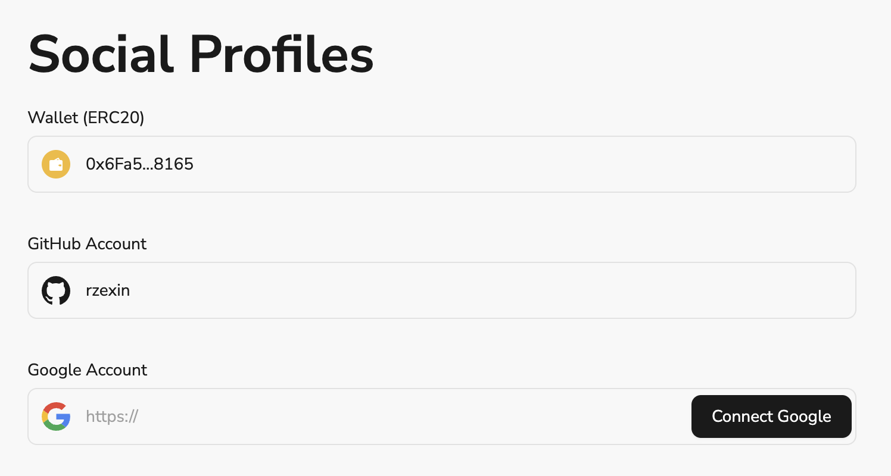

# Task2 Blockchain Basic

本任务分为简答题、分析题和选择题，以此为模板，在下方填写你的答案即可。

选择题，请在你选中的项目中，将 `[ ]` 改为 `[x]` 即可

## [单选题] 如果你莫名奇妙收到了一个 NFT，那么

- [ ] 天上掉米，我应该马上点开他的链接
- [x] 这可能是在对我进行诈骗！

## [单选题] 群里大哥给我发的网站，说能赚大米，我应该

- [ ] 赶紧冲啊，待会米被人抢了
- [x] 谨慎判断，不在不信任的网站链接钱包

## [单选题] 下列说法正确的是

- [x] 一个私钥对应一个地址
- [ ] 一个私钥对应多个地址
- [ ] 多个私钥对应一个地址
- [ ] 多个私钥对应多个地址

## [单选题] 下列哪个是以太坊虚拟机的简称

- [ ] CLR
- [x] EVM
- [ ] JVM

## [单选题] 以下哪个是以太坊上正确的地址格式？

- [ ] 1A4BHoT2sXFuHsyL6bnTcD1m6AP9C5uyT1
- [ ] TEEuMMSc6zPJD36gfjBAR2GmqT6Tu1Rcut
- [ ] 0x997fd71a4cf5d214009619808176b947aec122890a7fcee02e78e329596c94ba
- [x] 0xf39Fd6e51aad88F6F4ce6aB8827279cffFb92266

## [多选题] 有一天某个大哥说要按市场价的 80% 出油给你，有可能

- [x] 他在洗米
- [ ] 他良心发现
- [x] 要给我黒米
- [x] 给我下套呢

## [多选题] 以下哪些是以太坊的二层扩容方案？

- [ ] Lightning Network（闪电网络）
- [x] Optimsitic Rollup
- [x] Zk Rollup

## [简答题] 简述区块链的网络结构

```
区块链是一种分布式的、去中心化的网络结构，它由多个节点组成，这些节点共同维护着区块链交易账本。在区块链网络中，所有节点都遵循相同的共识算法来验证交易和更新区块链。这种去中心化的网络结构使得区块链具有很高的安全性、可靠性和透明性。
```

## [简答题] 智能合约是什么，有何作用？

```
智能合约是运行在区块链网络上的、通过交易触发的自动执行的程序。它的作用是：（1）自动执行，减少人工干预；（2）增加信任和透明度；（3）基于区块链去中心化的特性，具备高安全性，保护参与方利益；（4）降低成本
```

## [简答题] 怎么理解大家常说的 `EVM` 这个词汇？

```
EVM指的是以太坊虚拟机，全称是：Ethereum Virtual Machine，是以太坊智能合约运行的环境。EVM为每个智能合约提供了一个独立的运行环境，确保合约代码不会影响到区块链网络中的其它部分。EVM支持图灵完备的编程语言，使得开发者可以编写复杂的程序。并且能通过Gas机制来限制智能合约执行资源，防止恶意合约占用过多资源。
```

## [分析题] 你对去中心化的理解

```
去中心化的决策权和控制权没有集中到一个中心节点，将决策权分散到网络中的各个共识节点上，为构建公平、开放、自由的数字社会提供了可能，但去中心化同样也有不足，例如效率问题、治理问题等。
```

## [分析题] 比较区块链与传统数据库，你的看法？

```
（1）数据存储：传统数据库通常是中心化的，数据存储在单个或多个中心服务器上。而区块链是去中心化的，数据被分布在网络中的所有节点。

（2）数据修改：在传统数据库中，管理员或具有权限的用户可以随时修改或删除数据。而在区块链中，一旦数据被添加到区块链，就无法被修改或删除，这保证了数据的不可篡改性。

（3）透明性：传统数据库的数据访问和修改通常是私有的，只有授权的用户才能访问。而公有链区块链的数据是公开的，所有节点都可以查看和验证。

（4）安全性：由于数据集中存储，传统数据库面临中心化作恶风险。而区块链的分布式结构和加密技术使其具有很高的安全性。

（5）效率：传统数据库由于其中心化的结构，通常在处理大量事务时具有较高的效率。而区块链需要所有节点参与验证和共识，因此在处理速度上相对较慢。

（6）应用场景：传统数据库适用于大多数常规的数据存储和处理任务，而区块链更适合于需要高安全性、透明度和去中心化的应用，如金融交易、供应链管理等。

我的看法，区块链与传统数据库各有优缺点，适用于不同的应用场景，通常情况下也可以相结合进行使用。
```

## 操作题

安装一个 WEB3 钱包，创建账户后与 [openbuild.xyz](https://openbuild.xyz/profile) 进行绑定，截图后文件命名为 `./bind-wallet.jpg`.


