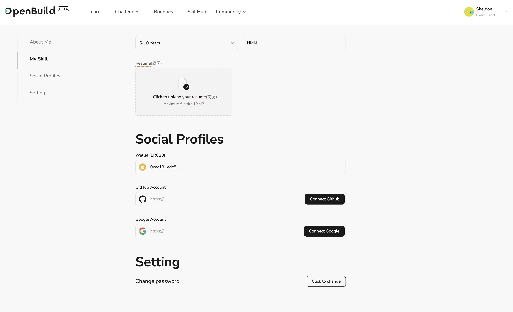

# Task2 Blockchain Basic

本任务分为简答题、分析题和选择题，以此为模板，在下方填写你的答案即可。

选择题，请在你选中的项目中，将 `[ ]` 改为 `[x]` 即可


## [单选题] 如果你莫名奇妙收到了一个 NFT，那么

- [ ] 天上掉米，我应该马上点开他的链接
- [x] 这可能是在对我进行诈骗！


## [单选题] 群里大哥给我发的网站，说能赚大米，我应该

- [ ] 赶紧冲啊，待会米被人抢了
- [x] 谨慎判断，不在不信任的网站链接钱包

## [单选题] 下列说法正确的是

- [x] 一个私钥对应一个地址
- [ ] 一个私钥对应多个地址
- [ ] 多个私钥对应一个地址
- [ ] 多个私钥对应多个地址

 ## [单选题] 下列哪个是以太坊虚拟机的简称

- [ ] CLR
- [x] EVM
- [ ] JVM

## [单选题] 以下哪个是以太坊上正确的地址格式？

- [ ] 1A4BHoT2sXFuHsyL6bnTcD1m6AP9C5uyT1
- [ ] TEEuMMSc6zPJD36gfjBAR2GmqT6Tu1Rcut
- [ ] 0x997fd71a4cf5d214009619808176b947aec122890a7fcee02e78e329596c94ba
- [x] 0xf39Fd6e51aad88F6F4ce6aB8827279cffFb92266
      
## [多选题] 有一天某个大哥说要按市场价的 80% 出油给你，有可能

- [x] 他在洗米
- [ ] 他良心发现
- [x] 要给我黒米
- [x] 给我下套呢

## [多选题] 以下哪些是以太坊的二层扩容方案？

- [ ] Lightning Network（闪电网络）
- [x] Optimsitic Rollup
- [x] Zk Rollup

## [简答题] 简述区块链的网络结构

```
区块链是一种分布式数据库，采用的网络结构主要有三种：公有链（Public Blockchain）、联盟链（Consortium Blockchain）和私有链（Private Blockchain）。
```


## [简答题] 智能合约是什么，有何作用？

```
区块链上的自动化程序或协议，在满足某些预设条件时激活。自动执行的合同直接写进代码，详细说明买卖家双方之间的协议条款。它们在使交易可追踪、透明和不可逆转方面发挥着关键作用，从而消除中介并减少时间延迟。
```


## [简答题] 怎么理解大家常说的 `EVM` 这个词汇？

```
EVM 以太坊虚拟机，相当于 Java 里的 jvm，可以把合约代码编译成以太坊识别可允许的机器码。
```


## [分析题] 你对去中心化的理解

```
去中心化不是不要中心，而是由节点来自由选择中心，自由决定中心。
```


## [分析题] 比较区块链与传统数据库，你的看法？

```
传统数据库：需要一定的访问权限去管理，被攻击或管理员泄露信息后，数据可能被泄露或被纂改。
区块链：允许互不信任的各方在不需要中央管理员的情况下共享信息。
```


## 操作题

安装一个 WEB3 钱包，创建账户后与 [openbuild.xyz](https://openbuild.xyz/profile) 进行绑定，截图后文件命名为 `./bind-wallet.jpg`.


