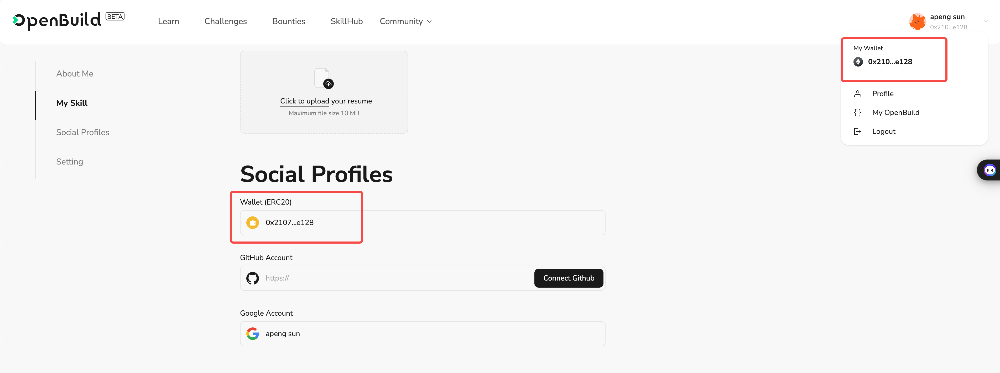

# Task2 Blockchain Basic

本任务分为简答题、分析题和选择题，以此为模板，在下方填写你的答案即可。

选择题，请在你选中的项目中，将 `[ ]` 改为 `[x]` 即可

## [单选题] 如果你莫名奇妙收到了一个 NFT，那么

- [ ] 天上掉米，我应该马上点开他的链接
- [X] 这可能是在对我进行诈骗！

## [单选题] 群里大哥给我发的网站，说能赚大米，我应该

- [ ] 赶紧冲啊，待会米被人抢了
- [X] 谨慎判断，不在不信任的网站链接钱包

## [单选题] 下列说法正确的是

- [X] 一个私钥对应一个地址
- [ ] 一个私钥对应多个地址
- [ ] 多个私钥对应一个地址
- [ ] 多个私钥对应多个地址

## [单选题] 下列哪个是以太坊虚拟机的简称

- [ ] CLR
- [X] EVM
- [ ] JVM

## [单选题] 以下哪个是以太坊上正确的地址格式？

- [ ] 1A4BHoT2sXFuHsyL6bnTcD1m6AP9C5uyT1
- [ ] TEEuMMSc6zPJD36gfjBAR2GmqT6Tu1Rcut
- [ ] 0x997fd71a4cf5d214009619808176b947aec122890a7fcee02e78e329596c94ba
- [X] 0xf39Fd6e51aad88F6F4ce6aB8827279cffFb92266

## [多选题] 有一天某个大哥说要按市场价的 80% 出油给你，有可能

- [X] 他在洗米
- [ ] 他良心发现
- [X] 要给我黒米
- [X] 给我下套呢

## [多选题] 以下哪些是以太坊的二层扩容方案？

- [ ] Lightning Network（闪电网络）
- [X] Optimsitic Rollup
- [X] Zk Rollup

## [简答题] 简述区块链的网络结构

```
区块链是一种分布式账本技术，其网络结构具有以下几个关键特征：
去中心化：区块链网络是一个去中心化的系统，没有中央控制点。所有节点（参与者）都有平等的地位，共同维护账本的完整性和安全性。
分布式账本：区块链的核心是分布式账本，所有交易记录都存储在多个节点上，每个节点都有一份完整的账本副本。这保证了数据的透明性和不可篡改性。
共识机制：为了确保各节点账本的一致性，区块链采用共识机制，如工作量证明（PoW）、权益证明（PoS）等。共识机制使得节点之间能够就交易的有效性达成一致。
数据结构：区块链以区块为单位存储数据，每个区块包含若干条交易记录。区块按时间顺序相连，形成链式结构，每个区块包含前一个区块的哈希值，确保了数据的不可篡改性。
点对点网络：区块链网络采用点对点（P2P）结构，节点之间通过直接连接进行通信和数据传输。这种结构提高了网络的容错能力和抗攻击能力。
智能合约：部分区块链网络（如以太坊）支持智能合约，即在区块链上执行的自动化程序。智能合约可以自动执行预定义的规则和条款，无需人工干预。
```

## [简答题] 智能合约是什么，有何作用？

```
智能合约是一种运行在区块链上的自动化协议。它们是一段预先编写好的代码，可以在特定条件下自动执行和执行合约条款。智能合约的主要作用包括以下几个方面：
自动执行合约：智能合约通过代码自动执行合约条款，无需人为干预。这确保了合约执行的准确性和及时性。
减少中介和降低成本：传统合约通常需要第三方中介（如律师或公证人）来监督和执行，而智能合约则不需要中介，降低了交易成本。
提高透明度和信任：智能合约的代码和交易记录在区块链上是公开透明的，任何人都可以查看。这提高了系统的透明度，减少了信任问题。
防止篡改和提高安全性：一旦智能合约部署到区块链上，其代码和数据就不能被篡改。这提高了合约的安全性，防止欺诈行为。
自动化和高效性：智能合约可以自动化处理复杂的交易流程，提高了系统的效率。例如，可以在特定条件满足时自动释放资金或转移资产。在此处填写你的答案
```

## [简答题] 怎么理解大家常说的 `EVM` 这个词汇？

```
EVM 是指以太坊虚拟机（Ethereum Virtual Machine）。它是以太坊区块链的核心组成部分，负责执行智能合约和运行去中心化应用（DApps）。EVM 的主要功能和作用包括：
智能合约执行环境：EVM 提供了一个运行智能合约的沙箱环境，确保合约代码在隔离的环境中执行，不会影响区块链的其他部分。
跨平台兼容性：EVM 是跨平台的，能够在各种计算机架构和操作系统上运行。这使得以太坊网络的节点可以在不同的硬件和软件环境中无缝协作。
确定性执行：EVM 确保智能合约的执行是确定性的，即在任何节点上运行相同的智能合约都会得到相同的结果。这对于区块链的一致性和可靠性至关重要。
状态维护：EVM 负责维护以太坊网络的状态，包括账户余额、合约存储和区块链的整体状态。每个交易的执行都会改变网络的状态，而这些变化由 EVM 处理和记录。
Gas 机制：EVM 使用 Gas 作为计量单位，衡量每个操作和计算的资源消耗。用户在执行智能合约时需要支付 Gas 费用，这有助于防止资源滥用和激励节点高效运行。在此处填写你的答案
```

## [分析题] 你对去中心化的理解

```
去中心化是指系统的控制权和决策权分散在多个节点或实体之间，而不是集中在单一的中心控制点。强调各参与方在系统中拥有相对平等的权力和地位，没有单一的实体拥有绝对的控制权。
```

## [分析题] 比较区块链与传统数据库，你的看法？

```
区块链：数据存储在多个节点上，每个节点都有完整的数据副本。由于数据写入需要共识机制（如PoW、PoS）确认，导致写入速度较慢。一旦写入数据，几乎不可能更改，确保数据的完整性和安全性。由于数据分布在多个节点上，读取操作可能会比较慢，尤其是在大规模网络中。由于去中心化和加密技术，区块链数据很难被篡改或攻击。所有交易记录公开透明，任何人都可以查看，这同时也是一种隐私挑战。
传统数据库：数据通常存储在一个或多个集中式服务器上。写入操作直接存储在服务器中，无需经过复杂的共识过程。支持CRUD操作（创建、读取、更新、删除），方便数据的更新和删除。优化后的查询引擎和索引机制使读取速度非常快。安全性取决于数据库管理系统的设计和管理措施，存在被黑客攻击的风险。数据访问权限可控，隐私保护较强，适合存储敏感信息。
```

## 操作题

安装一个 WEB3 钱包，创建账户后与 [openbuild.xyz](https://openbuild.xyz/profile) 进行绑定，截图后文件命名为 `./bind-wallet.jpg`.


