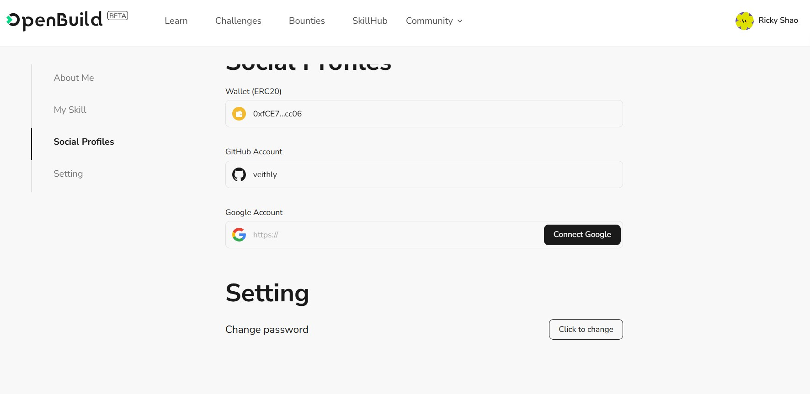

# Task2 Blockchain Basic

本任务分为简答题、分析题和选择题，以此为模板，在下方填写你的答案即可。

选择题，请在你选中的项目中，将 `[ ]` 改为 `[x]` 即可

## [单选题] 如果你莫名奇妙收到了一个 NFT，那么

- [ ] 天上掉米，我应该马上点开他的链接
- [x] 这可能是在对我进行诈骗！

## [单选题] 群里大哥给我发的网站，说能赚大米，我应该

- [ ] 赶紧冲啊，待会米被人抢了
- [x] 谨慎判断，不在不信任的网站链接钱包

## [单选题] 下列说法正确的是

- [ ] 一个私钥对应一个地址
- [x] 一个私钥对应多个地址
- [ ] 多个私钥对应一个地址
- [ ] 多个私钥对应多个地址

## [单选题] 下列哪个是以太坊虚拟机的简称

- [ ] CLR
- [x] EVM
- [ ] JVM

## [单选题] 以下哪个是以太坊上正确的地址格式？

- [ ] 1A4BHoT2sXFuHsyL6bnTcD1m6AP9C5uyT1
- [ ] TEEuMMSc6zPJD36gfjBAR2GmqT6Tu1Rcut
- [ ] 0x997fd71a4cf5d214009619808176b947aec122890a7fcee02e78e329596c94ba
- [x] 0xf39Fd6e51aad88F6F4ce6aB8827279cffFb92266

## [多选题] 有一天某个大哥说要按市场价的 80% 出油给你，有可能

- [x] 他在洗米
- [ ] 他良心发现
- [x] 要给我黒米
- [x] 给我下套呢

## [多选题] 以下哪些是以太坊的二层扩容方案？

- [ ] Lightning Network（闪电网络）
- [x] Optimsitic Rollup
- [x] Zk Rollup

## [简答题] 简述区块链的网络结构

```
区块链的网络结构是一个分布式的对等网络（P2P网络），在这个网络中，每个节点都存储着区块链的完整副本，并通过共识机制相互协作以确保数据的一致性和安全性。区块链网络的主要特点包括去中心化、不可篡改性和透明性。网络中的节点可以分为全节点和轻节点，全节点保存整个区块链的全部数据并参与验证交易和区块，而轻节点只保存部分数据以减少存储和计算负担。各节点通过传播和验证交易及区块数据，确保整个网络的运行和安全。
```

## [简答题] 智能合约是什么，有何作用？

```
智能合约是一种自执行的协议，嵌入在区块链中的代码，根据预定的条件自动执行合同条款。智能合约的主要作用包括自动化执行交易、减少中介成本、提高交易的透明度和安全性。它们可以用于各种应用场景，例如金融服务、供应链管理、数字身份验证等。由于智能合约的代码和执行结果都记录在区块链上，具有不可篡改性和高透明度，保证了合约的执行过程是可信且透明的。
```

## [简答题] 怎么理解大家常说的 `EVM` 这个词汇？

```
EVM，即以太坊虚拟机（Ethereum Virtual Machine），是以太坊区块链上的一个运行环境，负责执行智能合约的代码。EVM可以将智能合约编译成字节码，并在虚拟机中运行。它确保了智能合约的独立性和安全性，使得合约代码在以太坊网络上的每个节点都能被一致地执行。EVM的存在使得以太坊具备了强大的智能合约功能，能够支持去中心化应用（dApps）的开发和运行。
```

## [分析题] 你对去中心化的理解

```
去中心化是指在一个系统中没有中央控制点，而是通过多个节点的共同协作来实现系统的功能和管理。去中心化的主要特点包括分布式控制、抗审查性和更高的安全性。在区块链中，去中心化体现在所有节点都持有区块链的完整副本，并通过共识机制共同维护账本的安全和一致性。去中心化的优势在于它可以减少单点故障的风险，增加系统的透明度和信任度。然而，去中心化也可能带来效率降低、治理复杂性增加等问题，需要在实际应用中权衡利弊。
```

## [分析题] 比较区块链与传统数据库，你的看法？

```
区块链和传统数据库在结构和功能上有显著差异。区块链是分布式的，不可篡改的账本，每个节点都持有完整的数据副本，数据一旦写入区块链就不可修改。区块链通过共识机制确保数据的一致性和安全性，适用于需要高透明度和安全性的应用场景，例如金融交易、供应链管理等。

传统数据库通常是集中式的，由一个或多个中央服务器管理数据，支持CRUD操作（创建、读取、更新、删除），数据管理效率高，适用于大多数需要高性能和灵活数据操作的应用场景。

区块链的优点在于去中心化、透明性和安全性，但其性能相对较低，处理速度慢，存储成本高。传统数据库的优点在于高效的数据管理和处理能力，但其中心化结构可能带来安全和信任问题。

因此，区块链和传统数据库各有优劣，应根据具体应用场景的需求选择合适的技术。
```

## 操作题

安装一个 WEB3 钱包，创建账户后与 [openbuild.xyz](https://openbuild.xyz/profile) 进行绑定，截图后文件命名为 `./bind-wallet.jpg`.


