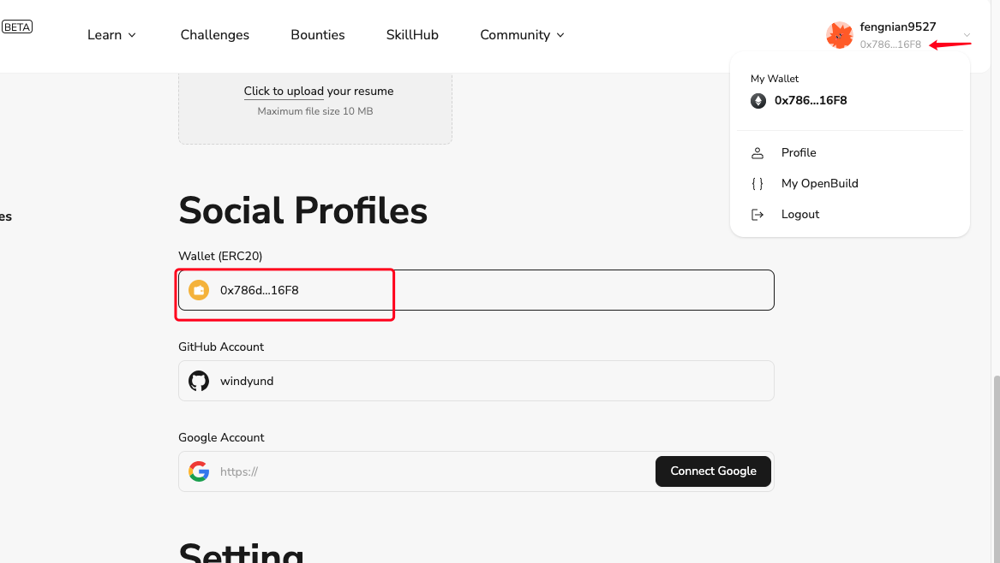

# Task2 Blockchain Basic

本任务分为简答题、分析题和选择题，以此为模板，在下方填写你的答案即可。

选择题，请在你选中的项目中，将 `[ ]` 改为 `[x]` 即可

## [单选题] 如果你莫名奇妙收到了一个 NFT，那么

- [ ] 天上掉米，我应该马上点开他的链接
- [x] 这可能是在对我进行诈骗！

## [单选题] 群里大哥给我发的网站，说能赚大米，我应该

- [ ] 赶紧冲啊，待会米被人抢了
- [x] 谨慎判断，不在不信任的网站链接钱包

## [单选题] 下列说法正确的是

- [x] 一个私钥对应一个地址
- [ ] 一个私钥对应多个地址
- [ ] 多个私钥对应一个地址
- [ ] 多个私钥对应多个地址

## [单选题] 下列哪个是以太坊虚拟机的简称

- [ ] CLR
- [x] EVM
- [ ] JVM

## [单选题] 以下哪个是以太坊上正确的地址格式？

- [ ] 1A4BHoT2sXFuHsyL6bnTcD1m6AP9C5uyT1
- [ ] TEEuMMSc6zPJD36gfjBAR2GmqT6Tu1Rcut
- [ ] 0x997fd71a4cf5d214009619808176b947aec122890a7fcee02e78e329596c94ba
- [x] 0xf39Fd6e51aad88F6F4ce6aB8827279cffFb92266

## [多选题] 有一天某个大哥说要按市场价的 80% 出油给你，有可能

- [x] 他在洗米
- [ ] 他良心发现
- [x] 要给我黒米
- [x] 给我下套呢

## [多选题] 以下哪些是以太坊的二层扩容方案？

- [ ] Lightning Network（闪电网络）
- [x] Optimsitic Rollup
- [x] Zk Rollup

## [简答题] 简述区块链的网络结构

```
区块链的网络结构是分布式、去中心化的，它由多个节点（参与者）组成，每个节点都维护一份相同的账本副本。以下是区块链网络结构的主要特点和组件：

1. 去中心化网络
分布式节点：区块链网络由多个分布在全球各地的节点组成。这些节点可以是个人计算机、服务器或其他设备。
无中央控制：没有单一的中央控制机构或服务器。所有节点共同参与决策和验证交易。
2. 点对点（P2P）网络
直接通信：节点之间通过点对点协议直接通信，而不是通过中央服务器。每个节点都可以与其他节点通信并共享信息。
传播机制：新交易和区块通过广播在整个网络中传播。每个节点接收到信息后，会将其转发给其他节点，直到整个网络都收到信息。
3. 节点类型
全节点（Full Nodes）：保存区块链的完整副本，并参与交易验证和区块生成。全节点对网络的安全性和去中心化至关重要。
轻节点（Lightweight Nodes 或 SPV Nodes）：只保存区块链的头部信息（如区块头），而不是完整的交易数据。轻节点依赖全节点来验证交易。
矿工节点（Mining Nodes）：专门用于挖矿，通过解决复杂的数学问题（工作量证明，PoW）来创建新的区块并添加到区块链中。
4. 共识机制
工作量证明（PoW）：节点通过解决复杂的数学问题来竞争记账权。最先解决问题的节点可以将新的区块添加到区块链中（如比特币）。
权益证明（PoS）：节点通过持有的加密货币数量（权益）来竞争记账权。持有更多币的节点更有可能被选中添加新的区块（如以太坊2.0）。
其他共识机制：包括委托权益证明（DPoS）、实用拜占庭容错（PBFT）等，不同区块链项目采用不同的共识机制来平衡安全性、去中心化和效率。
5. 数据结构
区块：区块链由一系列区块组成，每个区块包含一组交易记录、时间戳、前一个区块的哈希值等。
链：区块按顺序链接在一起，形成一条链。每个区块包含前一个区块的哈希值，确保数据的不可篡改性和安全性。
6. 安全机制
密码学：广泛使用公钥和私钥加密技术来确保交易的安全性和隐私性。
哈希函数：通过哈希函数生成唯一的数字指纹，确保区块和交易数据的完整性。
总结
区块链的网络结构具有去中心化、分布式、点对点通信等特点，依赖于各种节点共同维护和验证账本，通过不同的共识机制确保数据的安全和一致性。这样的结构设计使得区块链网络具有高容错性、抗审查性和透明性，适用于各种分布式应用场景。


```

## [简答题] 智能合约是什么，有何作用？

```
智能合约（Smart Contract）是一种运行在区块链上的程序，类似云函数，按照既定规则执行
智能合约的主要作用是确保在无需中介或第三方的情况下，可信地执行和验证合约条款，从而实现去中心化和自动化的交易。

智能合约的特点和作用
自动化执行
一旦满足预定条件，智能合约将自动执行合约条款，减少人为干预和错误。
例如，A 和 B 签订一个智能合约，当 A 向智能合约支付一定金额后，B 将自动收到支付。
去中心化
智能合约运行在去中心化的区块链网络上，没有中央控制机构或服务器。
交易和合约条款由区块链上的所有节点共同验证和执行。
透明性
智能合约的代码和执行结果在区块链上是公开和透明的，任何人都可以查看和验证。
这种透明性增加了信任度，减少了欺诈的可能性。
不可篡改性
一旦部署到区块链上，智能合约的代码和状态是不可更改的。
这种特性确保了合约条款和执行的可靠性。
减少中介和成本
智能合约不需要中介或第三方验证，从而减少了中介费用和时间成本。
自动化和去中心化的特性降低了交易成本和复杂性。
```

## [简答题] 怎么理解大家常说的 `EVM` 这个词汇？

```
EVM 是 Ethereum Virtual Machine 的缩写，即以太坊虚拟机。EVM 是以太坊区块链的核心组件之一，它是一个图灵完备的虚拟机，用于执行智能合约和管理以太坊网络中的状态转变。理解 EVM 的概念对理解以太坊生态系统的运作至关重要。

EVM 的主要作用
1.智能合约执行
EVM 执行部署在以太坊区块链上的智能合约代码。每个智能合约在 EVM 中都有一个独立的执行环境。
智能合约是用高级编程语言（如 Solidity）编写的，经过编译后变成 EVM 字节码，EVM 负责解释和执行这些字节码。
2.状态管理
EVM 维护和管理整个以太坊网络的状态，包括账户余额、智能合约的状态和存储等。
每个以太坊节点都运行一个 EVM 实例，确保区块链的状态在整个网络中保持一致。
3.图灵完备性
EVM 是图灵完备的，这意味着它可以执行任何计算任务，只要提供足够的资源（例如 Gas）。
图灵完备性使得以太坊具备了很高的灵活性，可以支持各种复杂的去中心化应用（dApps）
```

## [分析题] 你对去中心化的理解

```
去中心化（Decentralization）是指将权力和控制从中央集权实体（如一个单一的组织或政府）转移到分布在不同地点和个体的网络中。去中心化的理念在许多领域都有应用，尤其是在区块链和加密货币领域。以下是对去中心化的详细理解：
去中心化的核心概念
1.权力分散
去中心化系统中没有单一的权力中心。决策和控制权力分散在多个独立的实体或节点之间。
这种分散有助于防止滥用权力和单点故障。
2.透明性和信任
去中心化系统通过公开透明的方式运作，使得所有参与者都能看到系统的运作过程。
透明性增加了信任，因为所有交易和操作都是公开可验证的。
3.抗审查性
去中心化系统难以被单一实体控制或审查，这使得信息和交易更难被操纵或阻止。
这在一些对抗审查的应用场景（如新闻传播、金融交易）中尤为重要。
4.容错性和弹性
去中心化系统具有更高的容错性，因为即使一些节点失效，系统仍然可以正常运作。
这种特性提高了系统的可靠性和稳定性
```

## [分析题] 比较区块链与传统数据库，你的看法？

```
区块链和传统数据库都是用于存储和管理数据的技术，但它们在结构、功能、应用场景和特点上有显著的区别。以下是对区块链和传统数据库的详细比较：
1. 数据结构
区块链
链式结构：数据以区块的形式存储，每个区块包含一组交易记录。区块按顺序链接在一起，每个区块包含前一个区块的哈希值。
不可变性：一旦数据写入区块链并被验证，它就不可篡改。这是通过加密哈希和共识机制实现的。
传统数据库
表格或树形结构：数据以表格（关系型数据库）或树形（非关系型数据库，如NoSQL）的形式存储。
可变性：数据可以被创建、读取、更新和删除（CRUD），修改历史通常不可追踪或需额外设计。
2. 数据一致性和管理
区块链
分布式账本：每个节点保存一份完整的账本副本。通过共识机制（如PoW、PoS）保证数据一致性。
去中心化管理：没有中央控制机构，所有节点共同参与决策和验证。
传统数据库
集中式存储：数据存储在一个或多个集中式服务器中，由一个中央控制实体管理。
集中式管理：数据库管理员（DBA）负责数据库的维护和管理。
3. 安全性和透明性
区块链
高安全性：通过加密、哈希和共识机制确保数据的安全和不可篡改。
透明性：交易记录公开可查，所有节点可以验证数据的完整性和真实性。
传统数据库
安全性依赖于访问控制：通过用户权限和访问控制机制保护数据。
透明性有限：数据和修改记录通常不公开，透明性依赖于中央管理者的设置和权限。
4. 性能和扩展性
区块链
性能瓶颈：由于共识机制和去中心化特点，交易处理速度较慢，扩展性有限。例如，比特币每秒处理约7笔交易，以太坊每秒处理约15-30笔交易。
扩展性挑战：区块链需要解决扩展性问题，以支持更多用户和更高的交易量。
传统数据库
高性能：集中式架构和优化技术（如索引、缓存）使传统数据库具有高性能，能处理大量并发请求。
良好的扩展性：通过分片、复制和负载均衡技术，传统数据库可以轻松扩展以支持更多数据和用户。
```

## 操作题

安装一个 WEB3 钱包，创建账户后与 [openbuild.xyz](https://openbuild.xyz/profile) 进行绑定，截图后文件命名为 `./bind-wallet.jpg`.
