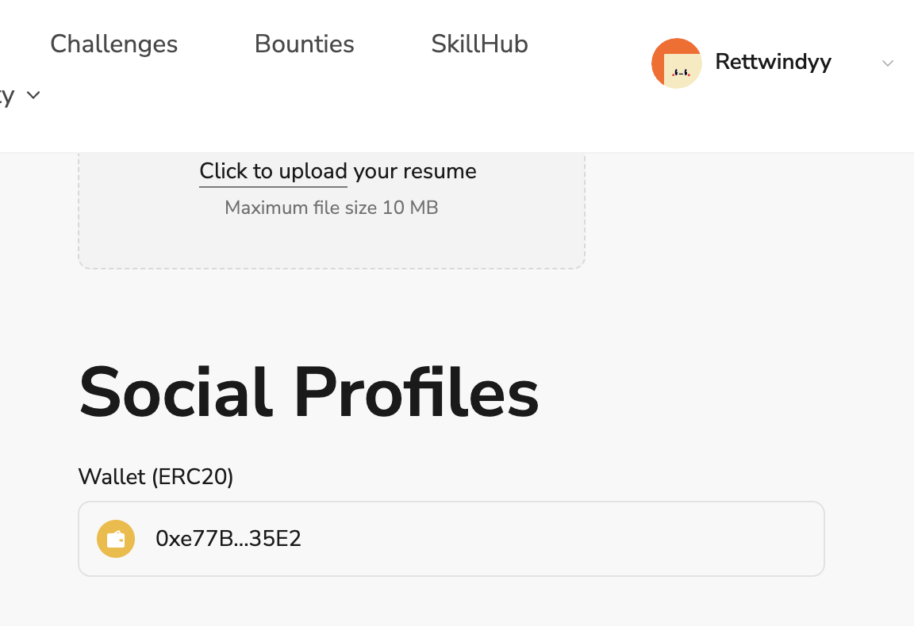

# Task2 Blockchain Basic

本任务分为简答题、分析题和选择题，以此为模板，在下方填写你的答案即可。

选择题，请在你选中的项目中，将 `[ ]` 改为 `[x]` 即可

## [单选题] 如果你莫名奇妙收到了一个 NFT，那么

- [ ] 天上掉米，我应该马上点开他的链接
- [x] 这可能是在对我进行诈骗！

## [单选题] 群里大哥给我发的网站，说能赚大米，我应该

- [ ] 赶紧冲啊，待会米被人抢了
- [x] 谨慎判断，不在不信任的网站链接钱包

## [单选题] 下列说法正确的是

- [x] 一个私钥对应一个地址
- [ ] 一个私钥对应多个地址
- [ ] 多个私钥对应一个地址
- [ ] 多个私钥对应多个地址

## [单选题] 下列哪个是以太坊虚拟机的简称

- [ ] CLR
- [x] EVM
- [ ] JVM

## [单选题] 以下哪个是以太坊上正确的地址格式？

- [ ] 1A4BHoT2sXFuHsyL6bnTcD1m6AP9C5uyT1
- [ ] TEEuMMSc6zPJD36gfjBAR2GmqT6Tu1Rcut
- [ ] 0x997fd71a4cf5d214009619808176b947aec122890a7fcee02e78e329596c94ba
- [x] 0xf39Fd6e51aad88F6F4ce6aB8827279cffFb92266

## [多选题] 有一天某个大哥说要按市场价的 80% 出油给你，有可能

- [x] 他在洗米
- [ ] 他良心发现
- [x] 要给我黒米
- [x] 给我下套呢

## [多选题] 以下哪些是以太坊的二层扩容方案？

- [ ] Lightning Network（闪电网络）
- [x] Optimsitic Rollup
- [x] Zk Rollup

## [简答题] 简述区块链的网络结构

```
区块链网络是一个去中心化网络，由多个参与者节点通过P2P网络组成，没有中心服务器，每个节点即是客户端也是服务器，并保存着区块链的完整或部分副本。区块链可以看作由交易驱动的状态机，交易在网络中广播，节点之间通过共识机制（PoS、PoW、PBFT等）对交易数据达成一致，验证后记录在区块中，区块组织为哈希链表结构，形成不可篡改的分布式账本。
```

## [简答题] 智能合约是什么，有何作用？

```
智能合约是部署在区块链之上的代码，区块链保证了它能够公开透明地运行且无法篡改，即程序化的合同。智能合约有着不可篡改、自动执行的特性以及可以预测的结果，它降低了人与人之间信任的成本，消除了中间机构，并且为区块链带来了构建多种区中心化应用的能力。
```

## [简答题] 怎么理解大家常说的 `EVM` 这个词汇？

```
以太坊虚拟机（Ethereum Virtual Machine），是以太坊中运行智能合约的图灵完备的虚拟机，智能合约被编译为字节码在 EVM 中运行，EVM 通过确定行的执行环境和有效的资源管理确保每个节点的一致状态和安全性。
```

## [分析题] 你对去中心化的理解

```
没有中央机构，公开透明，减少了单点故障以及信任的成本，每个人都可以安全地加入并维护，更加开放。
```

## [分析题] 比较区块链与传统数据库，你的看法？

```
区块链更加安全，减少了单点故障的风险，控制权限由单一实体转向网络所有成员；更加透明；成本更高，性能较差。
```

## 操作题

安装一个 WEB3 钱包，创建账户后与 [openbuild.xyz](https://openbuild.xyz/profile) 进行绑定，截图后文件命名为 `./bind-wallet.jpg`.


