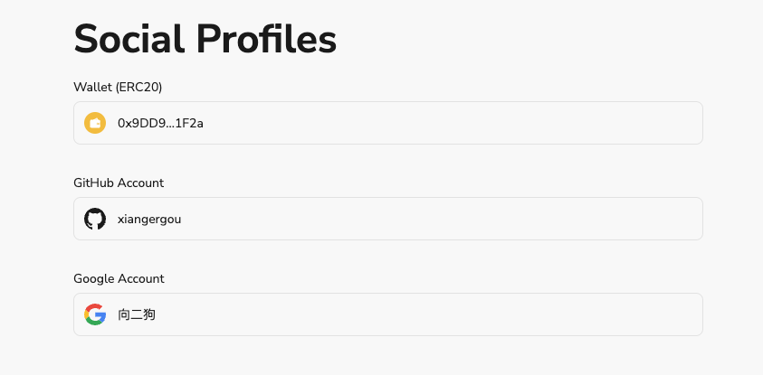

# Task2 Blockchain Basic

选择题，请在你选中的项目中，将 `[ ]` 改为 `[x]` 即可

## [单选题] 如果你莫名奇妙收到了一个 NFT，那么

- [ ] 天上掉米，我应该马上点开他的链接
- [x] 这可能是在对我进行诈骗！

## [单选题] 群里大哥给我发的网站，说能赚大米，我应该

- [ ] 赶紧冲啊，待会米被人抢了
- [x] 谨慎判断，不在不信任的网站链接钱包

## [单选题] 下列说法正确的是

- [x] 一个私钥对应一个地址
- [ ] 一个私钥对应多个地址
- [ ] 多个私钥对应一个地址
- [ ] 多个私钥对应多个地址

## [单选题] 下列哪个是以太坊虚拟机的简称

- [ ] CLR
- [x] EVM
- [ ] JVM

## [单选题] 以下哪个是以太坊上正确的地址格式？

- [ ] 1A4BHoT2sXFuHsyL6bnTcD1m6AP9C5uyT1
- [ ] TEEuMMSc6zPJD36gfjBAR2GmqT6Tu1Rcut
- [ ] 0x997fd71a4cf5d214009619808176b947aec122890a7fcee02e78e329596c94ba
- [x] 0xf39Fd6e51aad88F6F4ce6aB8827279cffFb92266

## [多选题] 有一天某个大哥说要按市场价的 80% 出油给你，有可能

- [x] 他在洗米
- [ ] 他良心发现
- [x] 要给我黒米
- [x] 给我下套呢

## [多选题] 以下哪些是以太坊的二层扩容方案？

- [ ] Lightning Network（闪电网络）
- [x] Optimsitic Rollup
- [x] Zk Rollup

## [简答题] 简述区块链的网络结构

```

- 区块链网络：由大量节点构成的分布式网络，通过共识算法来确保数据一致性。
- 节点：参与区块链网络的计算机或设备。
    * 全节点（Full Nodes）
	* 轻节点（Light Nodes）：只存储区块头，不存储完整的区块数据，依赖全节点进行验证。
	* 矿工节点（Mining Nodes）：通过解决复杂的数学问题(insignificance)来验证交易和创建新块。
- 区块：区块链上的基本数据单元，每个区块包含一组交易数据和一个区块头。
- 交易：区块链上的信息交换单位，由一方发起，经过验证后写入区块链。

```

## [简答题] 智能合约是什么，有何作用？

```

智能合约是运行在区块链上的自动化程序，在预定条件满足时自动执行和验证合约条款，具有不可篡改性和透明性。它通过消除中介机构、减少人为错误和欺诈行为，提高交易效率和降低成本，广泛应用于金融服务、供应链管理、房地产和数字身份认证等领域。
特点：
	- 自动化交易：智能合约可以用于自动化金融交易，如支付、转账、贷款、保险等。当特定条件（如到期日或价格触发）满足时，合约自动执行交易。
	- 数字资产管理：管理和转移数字资产（如代币、NFT），确保所有权和交易的透明性和安全性。
	- 供应链管理：跟踪和管理供应链中的货物和信息流，确保每个环节的透明和可追溯。
	- 去中心化金融（DeFi）：智能合约是DeFi应用的基础，支持去中心化的借贷、交易、稳定币和衍生品市场。
	- 自动化合约执行：如房屋租赁合约、雇佣合约等，自动执行合同条款，减少争议和中介费用。

```

## [简答题] 怎么理解大家常说的 `EVM` 这个词汇？

```

EVM（以太坊虚拟机）是以太坊区块链上智能合约的运行环境，负责解释和执行智能合约代码，确保所有节点对合约执行结果达成一致。它通过 Gas 机制管理计算资源消耗，防止资源滥用，是实现去中心化应用的核心组件。

```

## [分析题] 你对去中心化的理解

```

去中心化 = de + centration

1.centration：
简言之即中央集权。 控制权和决策权集中在一个或少数几个实体手中的结构或系统中。

2.de：
指的是去除中心化的特征，即去中心化的系统或组织。

3.区块链的去中心化特征
  1.去中心化存储：区块链的每个节点都存储着整个区块链的历史记录，不受任何单一实体的控制。
  2. 去中心化身份：区块链的每个节点都有自己的身份，可以代表自己发起交易。
  3. 去中心化治理：区块链的治理过程由各个节点共同完成，不受任何单一实体的控制。
  4. 去中心化计算：区块链的节点可以根据共识算法执行智能合约，不受任何单一实体的控制。

4. 思考
  观点 1：中心化是且将长久是主流。
  - 中心化是人类文明的必然，早在人类形成「部落」这种社会结构时，中心化的治理模式就已出现，这是根植于智慧生物的本能所致。
  - 现代社会下，资本与劳动力通过"制度和法律"和谐共存，制度保证各个部门之间形成有效分工，法律保证资本予劳动力以报酬。通过中心化的方式保证上级的命令从上至下层层传递，构成一个等级森严的庞大组织。公司如此，政府组织如此，学校如此，社区如此，甚至 openBuild 应该也是如此。
  - “独裁或致腐朽，但也更具效率”。

  观点 2: 去中心化任重道远
    1. 成本较大。目前去中心化的方式建立在巨大成本比如存储、挖矿、维护等，需要进一步优化。
    2. 公平存疑。以太坊上面的 NFT，目前 9%的账户掌握了 80%以上的财富；比特币持有者中，前 2%的账户掌握了 95%以上的市值；如果比特币是一个国家的话，没有一个国家的不平等程度能赶超比特币。
    3. 民主待榷。 DAO的理念建立在人人如龙的假设下。“券商的所有参与者都可以通过投票来进行公司的决策和治理的方式，早就被市场证明了是非常低效的。”
    3. 信仰支撑。公平啊，公正啊，透明啊，自由啊，自由啊，自由啊。总有无数人前赴后继奋力追求，这就是他们说的专属于人类的浪漫。

  观点 3： 相信后人的智慧
    1. 人类社会的运转依靠少数人制造的惯性，但总会有反惯性的力量出现，或以惊雷震天，或以润物无声之势改变这个世界。世界的主流一直是中心化，但数千年的发展，我们的文明仍已无力解决自身的问题，~~向外寻求救援是我们唯一的希望。~~ 或许，去中心化值得一试？
    2. 任何一种技术、制度都需要不断的迭代和优化。星火已现，且待来年。

```

## [分析题] 比较区块链与传统数据库，你的看法？

```

区块链：公开、透明、低效。适合需要跨组织合作和数据公开透明的场景。
传统数据库：集中、高效、低安全。适用于企业内部的数据管理和日常运营。

```

## 操作题

安装一个 WEB3 钱包，创建账户后与 [openbuild.xyz](https://openbuild.xyz/profile) 进行绑定，截图后文件命名为 `./bind-wallet.jpg`.



```

```
