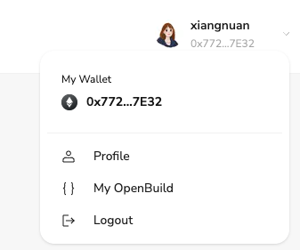

# Task2 Blockchain Basic

本任务分为简答题、分析题和选择题，以此为模板，在下方填写你的答案即可。

选择题，请在你选中的项目中，将 `[ ]` 改为 `[x]` 即可


## [单选题] 如果你莫名奇妙收到了一个 NFT，那么

- [ ] 天上掉米，我应该马上点开他的链接
- [x] 这可能是在对我进行诈骗！


## [单选题] 群里大哥给我发的网站，说能赚大米，我应该

- [ ] 赶紧冲啊，待会米被人抢了
- [x] 谨慎判断，不在不信任的网站链接钱包

## [单选题] 下列说法正确的是

- [x] 一个私钥对应一个地址
- [ ] 一个私钥对应多个地址
- [ ] 多个私钥对应一个地址
- [ ] 多个私钥对应多个地址

 ## [单选题] 下列哪个是以太坊虚拟机的简称

- [ ] CLR
- [x] EVM
- [ ] JVM

## [单选题] 以下哪个是以太坊上正确的地址格式？

- [ ] 1A4BHoT2sXFuHsyL6bnTcD1m6AP9C5uyT1
- [ ] TEEuMMSc6zPJD36gfjBAR2GmqT6Tu1Rcut
- [ ] 0x997fd71a4cf5d214009619808176b947aec122890a7fcee02e78e329596c94ba
- [x] 0xf39Fd6e51aad88F6F4ce6aB8827279cffFb92266
      
## [多选题] 有一天某个大哥说要按市场价的 80% 出油给你，有可能

- [x] 他在洗米
- [ ] 他良心发现
- [x] 要给我黒米
- [x] 给我下套呢

## [多选题] 以下哪些是以太坊的二层扩容方案？

- [ ] Lightning Network（闪电网络）
- [x] Optimsitic Rollup
- [x] Zk Rollup

## [简答题] 简述区块链的网络结构

```
区块链的网络结构是一种分布式的、去中心化的网络系统，其特点和结构如下：

1. 去中心化结构
区块链网络由多个节点（计算机）组成，这些节点分布在全球各地，没有中心化的服务器或控制节点。每个节点都可以存储完整的区块链数据，并独立进行验证和共识。

2. 对等网络（P2P）
区块链网络采用对等（Peer-to-Peer，P2P）网络架构，每个节点在网络中地位平等，可以直接与其他节点通信。这样可以防止单点故障，提高网络的可靠性和容错性。

3. 共识机制
为了在去中心化的网络中达成一致，区块链使用共识机制，例如比特币的工作量证明（Proof of Work，PoW）和以太坊的权益证明（Proof of Stake，PoS）。这些机制确保所有节点对区块链的状态达成一致，防止双重支付和其他欺诈行为。

4. 分布式账本
区块链上的所有交易和数据都记录在一个分布式账本中。每个节点都维护一份完整的账本副本，并且这些副本通过共识机制保持同步。

5. 加密技术
区块链网络广泛使用加密技术来确保数据的安全性和隐私性。公钥和私钥用于身份验证和签名，哈希函数用于数据完整性验证。

6. 区块结构
区块链由一系列按时间顺序链接的区块组成。每个区块包含一组交易数据和一个指向前一个区块的哈希值。区块链的不可篡改性由此结构保证，因为篡改一个区块会导致后续所有区块的哈希值发生变化，极难实现。

7. 分叉机制
当网络中存在不同版本的区块链时，会产生分叉（fork）。分叉可以是暂时的，例如由于网络延迟导致的短暂分叉，也可以是永久的，例如比特币的硬分叉（如比特币现金的产生）。共识机制会帮助网络最终选择一个最长或最重的链作为主链。

8. 节点类型
在区块链网络中，节点可以分为不同类型：
- 全节点：存储和验证整个区块链数据，参与共识过程。
- 轻节点：只存储区块头，不存储全部数据，只进行部分验证。
- 矿工节点：专门进行区块打包和挖矿工作。

9. 激励机制
区块链网络通常会设计激励机制（例如比特币中的区块奖励和交易费）来激励节点参与区块验证和维护网络安全。

这些结构和机制共同构成了区块链的网络架构，确保其去中心化、安全性和可靠性。
```


## [简答题] 智能合约是什么，有何作用？

```md
智能合约（Smart Contract）是一种在区块链平台上运行的自执行代码，它能够在满足预设条件的情况下，自动执行和强制执行合约条款。智能合约的核心思想是通过代码来代替传统合同的法律条款，使得合同的执行和验证过程更加自动化、透明和可靠.

智能合约的应用场景
1. 金融服务：智能合约可以用于自动化金融交易、贷款、保险等，提高金融交易的效率和透明度。

2. 供应链管理：智能合约可以记录商品的生产、运输、交付等环节，确保供应链的透明和可信。

3. 数字身份：智能合约可以用于身份认证和管理，确保身份信息的安全和隐私。

4. 房地产：通过智能合约进行房地产交易，可以减少中介费用，确保交易的透明和安全。

5.法律和合规：智能合约可以用于自动化合同执行和合规检查，确保合同条款的严格执行。
```


## [简答题] 怎么理解大家常说的 `EVM` 这个词汇？

```
EVM是以太坊区块链的核心，它提供了一个去中心化、可信和安全的智能合约执行环境。通过EVM，开发者可以创建和部署复杂的去中心化应用，实现了从传统互联网到区块链互联网的功能转变。EVM的强大功能和灵活性，使其成为推动区块链技术发展的重要引擎。
```


## [分析题] 你对去中心化的理解

```
去中心化是一种改变传统集中化管理模式的新兴技术理念，具有安全、透明、抗审查和去中介化的优势。尽管在效率和治理方面面临挑战，但其在区块链、DeFi和DAO等领域的应用展示了巨大的潜力。未来，随着技术的进步和应用的扩展，去中心化将进一步推动各行业的创新和变革。
```


## [分析题] 比较区块链与传统数据库，你的看法？

```
区块链和传统数据库各有优劣，适用于不同的应用场景。区块链的优势在于去中心化、安全性、透明性和不可篡改性，适用于需要高度信任和安全的场景。而传统数据库在性能、效率和数据管理灵活性上更具优势，适合高频数据操作和实时性要求高的应用。根据具体需求选择合适的技术，可以充分发挥二者的优势。
```


## 操作题

安装一个 WEB3 钱包，创建账户后与 [openbuild.xyz](https://openbuild.xyz/profile) 进行绑定，截图后文件命名为 `./bind-wallet.jpg`.

