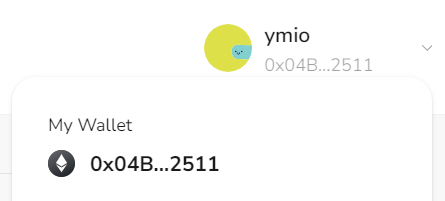

# Task2 Blockchain Basic

本任务分为简答题、分析题和选择题，以此为模板，在下方填写你的答案即可。

选择题，请在你选中的项目中，将 `[ ]` 改为 `[x]` 即可


## [单选题] 如果你莫名奇妙收到了一个 NFT，那么

- [ ] 天上掉米，我应该马上点开他的链接
- [x] 这可能是在对我进行诈骗！


## [单选题] 群里大哥给我发的网站，说能赚大米，我应该

- [ ] 赶紧冲啊，待会米被人抢了
- [x] 谨慎判断，不在不信任的网站链接钱包

## [单选题] 下列说法正确的是

- [x] 一个私钥对应一个地址
- [ ] 一个私钥对应多个地址
- [ ] 多个私钥对应一个地址
- [ ] 多个私钥对应多个地址

 ## [单选题] 下列哪个是以太坊虚拟机的简称

- [ ] CLR
- [x] EVM
- [ ] JVM

## [单选题] 以下哪个是以太坊上正确的地址格式？

- [ ] 1A4BHoT2sXFuHsyL6bnTcD1m6AP9C5uyT1
- [ ] TEEuMMSc6zPJD36gfjBAR2GmqT6Tu1Rcut
- [ ] 0x997fd71a4cf5d214009619808176b947aec122890a7fcee02e78e329596c94ba
- [x] 0xf39Fd6e51aad88F6F4ce6aB8827279cffFb92266

## [多选题] 有一天某个大哥说要按市场价的 80% 出油给你，有可能

- [x] 他在洗米
- [ ] 他良心发现
- [x] 要给我黒米
- [x] 给我下套呢

## [多选题] 以下哪些是以太坊的二层扩容方案？

- [ ] Lightning Network（闪电网络）
- [x] Optimsitic Rollup
- [x] Zk Rollup
## [简答题] 简述区块链的网络结构

```
区块链的网络结构：由 P2P 节点提供计算和存储资源，以区块的形式保存交易记录等状态数据。各节点间，按共识机制算法将新区块打包上链；各区块间，按时间顺序以链表结构链接在一起。
```

## [简答题] 智能合约是什么，有何作用？
```
智能合约就像链上的一个小服务器，拥有它自己的地址、数据、方法，可读可写。可以部署合约到所支持的区块链上，部署后合约代码在链上公开且不可修改。可以通过交易触发执行合约里的方法，让区块链拥有执行用户自定程序的能力。
```

## [简答题] 怎么理解大家常说的 `EVM` 这个词汇？

```
EVM 即以太坊虚拟机，智能合约的执行环境。有图灵完备、去中心化、安全的特点，维护整个以太坊网络的状态，并负责计算合约部署和状态更改的 Gas 费，确保智能合约在区块链上的正常运行。
```

## [分析题] 你对去中心化的理解

```
去中心化，从资源（数据）存储的角度，其数据被分布保存在各个节点上，而不是保存在单一的中心服务器上，保证了存储数据的透明且不可篡改。于此，数据治理无法通过单一中心来审查、修改或控制，改为依赖自动化算法和自发个体的共同维护，转为考验算法本身的正确性、个体是否有充分的自主自治能力。
```

## [分析题] 比较区块链与传统数据库，你的看法？

```
各有优势所在，区块链数据透明且不可篡改，但数据交易确认需要更长的时间，费用高；传统数据库查询写入速度更快，通常用户侧费用较低。未来或许会出现读写更快更高效的区块链，或对个人使用而言更隐私安全的数据库。可以依据适用场景，两者相互结合，有些涉及交易合约的数据我们希望它透明不可改动更好，有些数据我们也不希望它们公开透明。
```


## 操作题

安装一个 WEB3 钱包，创建账户后与 [openbuild.xyz](https://openbuild.xyz/profile) 进行绑定，截图后文件命名为 `./bind-wallet.jpg`.


