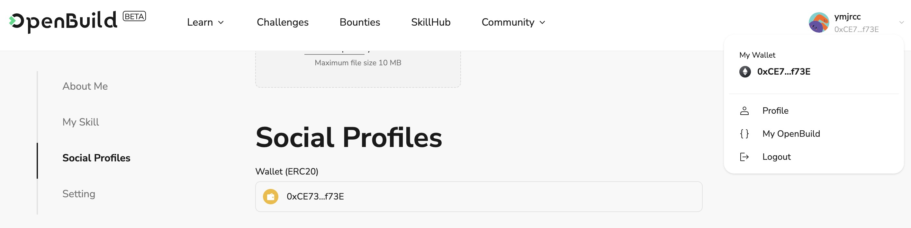

# Task2 Blockchain Basic

本任务分为简答题、分析题和选择题，以此为模板，在下方填写你的答案即可。

选择题，请在你选中的项目中，将 `[ ]` 改为 `[x]` 即可

## [单选题] 如果你莫名奇妙收到了一个 NFT，那么

- [ ] 天上掉米，我应该马上点开他的链接
- [x] 这可能是在对我进行诈骗！

## [单选题] 群里大哥给我发的网站，说能赚大米，我应该

- [ ] 赶紧冲啊，待会米被人抢了
- [x] 谨慎判断，不在不信任的网站链接钱包

## [单选题] 下列说法正确的是

- [x] 一个私钥对应一个地址
- [ ] 一个私钥对应多个地址
- [ ] 多个私钥对应一个地址
- [ ] 多个私钥对应多个地址

## [单选题] 下列哪个是以太坊虚拟机的简称

- [ ] CLR
- [x] EVM
- [ ] JVM

## [单选题] 以下哪个是以太坊上正确的地址格式？

- [ ] 1A4BHoT2sXFuHsyL6bnTcD1m6AP9C5uyT1
- [ ] TEEuMMSc6zPJD36gfjBAR2GmqT6Tu1Rcut
- [ ] 0x997fd71a4cf5d214009619808176b947aec122890a7fcee02e78e329596c94ba
- [x] 0xf39Fd6e51aad88F6F4ce6aB8827279cffFb92266

## [多选题] 有一天某个大哥说要按市场价的 80% 出油给你，有可能

- [x] 他在洗米
- [ ] 他良心发现
- [x] 要给我黒米
- [x] 给我下套呢

## [多选题] 以下哪些是以太坊的二层扩容方案？

- [ ] Lightning Network（闪电网络）
- [x] Optimsitic Rollup
- [x] Zk Rollup

## [简答题] 简述区块链的网络结构

```
区块链的网络结构通常是去中心化的点对点（P2P）网络，这种结构确保了数据的分布和安全性。
区块链没有中央服务器或单一控制点，所有节点都是对等的，所有节点都可以独立验证和存储区块链数据。每个节点都有一份完整的区块链副本，所有节点的数据通过共识机制保持一致。这种网络结构使得区块链有很高的安全性和不可篡改性，但也使得区块链网络效率低下，链上存储昂贵（需要消耗 gas）。


```

## [简答题] 智能合约是什么，有何作用？

```
智能合约是链上运行的程序，本质是一串字节码，通过外部账号或合约工厂部署到区块链上。一旦部署，将持续运行且不可篡改。有了智能合约，我们可以在搭建各种 DApp，如各种去中心化交易所、链上游戏、链上社交网络等。智能合约大大丰富了区块链的运用场景，有了智能合约，我们可以在区块链上实现各种功能。
```

## [简答题] 怎么理解大家常说的 `EVM` 这个词汇？

```
EVM 是 "Ethereum Virtual Machine"（以太坊虚拟机）的缩写。EVM 执行以太坊上的智能合约，处理以太坊上的交易，维护整个以太坊网络的状态……可以理解为是以太坊区块链的基础设施和运行环境。
```

## [分析题] 你对去中心化的理解

```
去中心化是相对于中心化的反义词。传统的 web2 世界是中心化的，比如银行转账要依靠于银联的服务、使用网络服务需要在服务提供方注册登录、网络资源保存在云端，归根结底还是存在大公司的服务器里……去中心化与之相反，去中心化通过分布式网络来实现数据存储、处理和传输，而不依赖单一中心化的服务器或机构。每个人都可以完全掌握自己的数据和资源，且公开透明，通过公私钥账号的方式还获得了一定的匿名性，可以实现很多在中心化世界中无法实现的行为，比如 DEX 实现去中心化交易使得交易更加安全便捷、比如 DAO 治理探索各种新的组织形式……但去中心化也有效率低下、黑客横行难以追踪等缺点，但总的来说我觉得去中心化让这个世界更加丰富和多元，也让每一个个体更加有价值。
```

## [分析题] 比较区块链与传统数据库，你的看法？

```
传统数据库是中心化的，效率高，但数据存在中心化服务器中，透明性和安全性不高。
区块链是去中心化的，数据分布式存储，具有比较高的透明性和安全性，但是也有数据更新效率低、链上存储昂贵（需要消耗 gas）等缺点。
二者各有各的优点和不足，也各有各的使用场景，没有谁优谁劣，需要针对具体场景来分析和选型。
```

## 操作题

安装一个 WEB3 钱包，创建账户后与 [openbuild.xyz](https://openbuild.xyz/profile) 进行绑定，截图后文件命名为 `./bind-wallet.jpg`.


