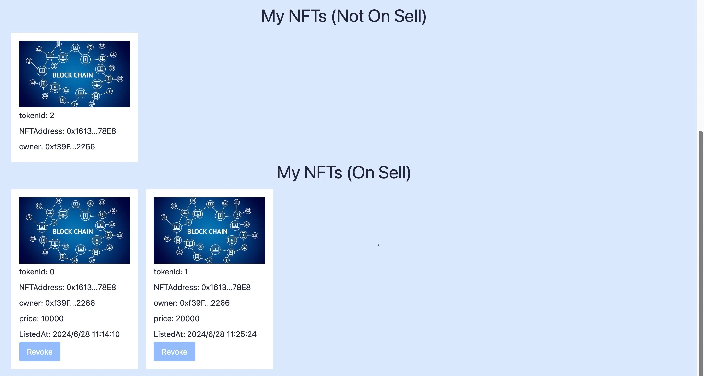
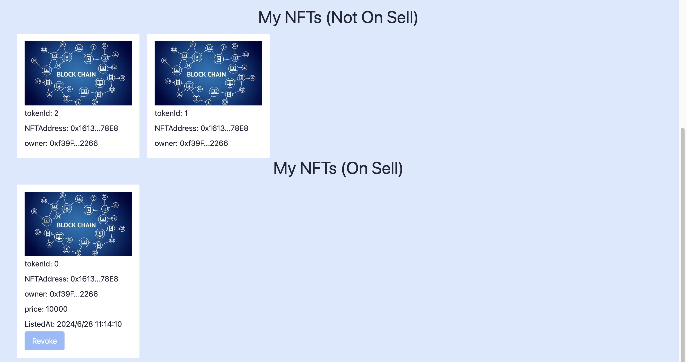
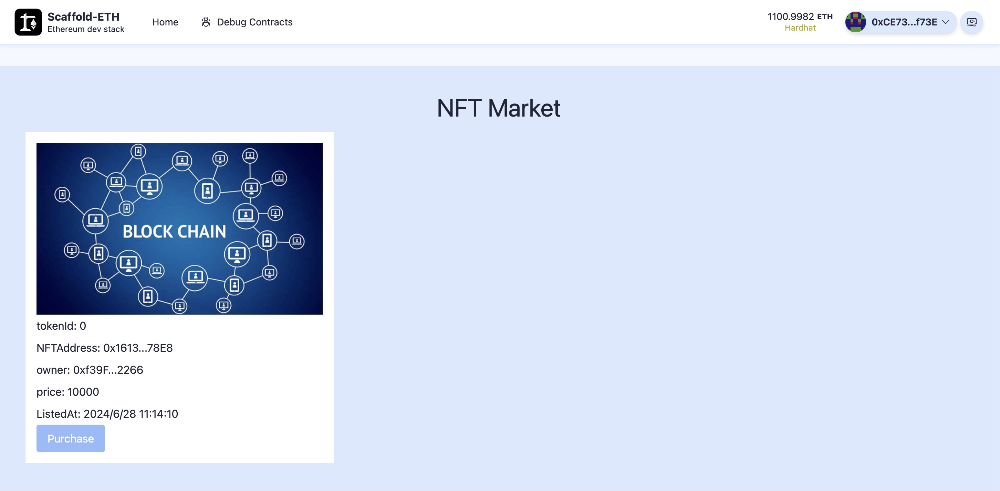
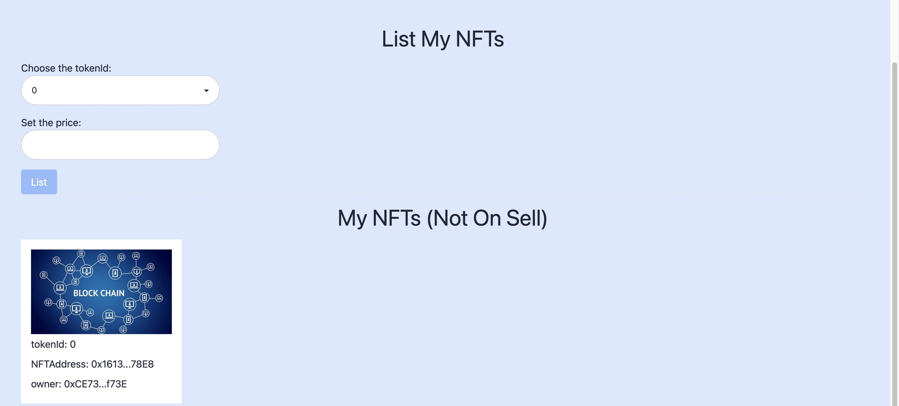
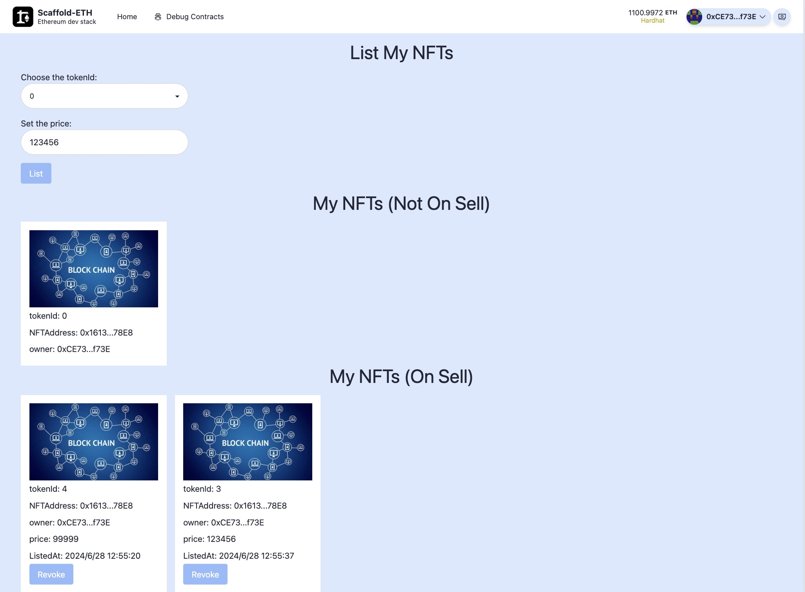
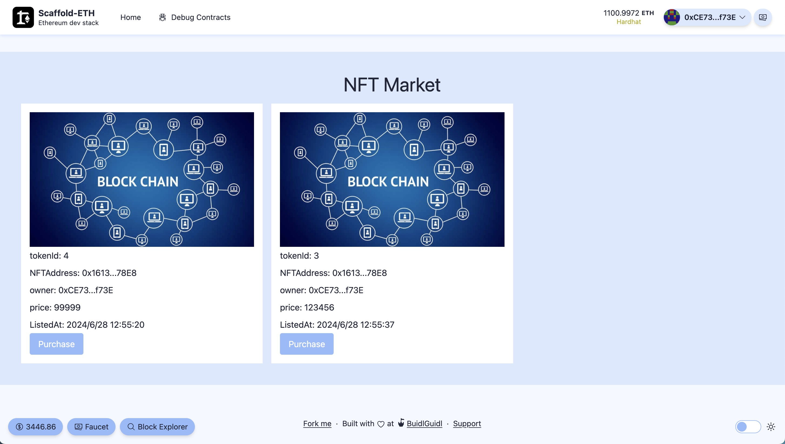

- 合约代码位于 /hardhat/contract
- 前端代码位于 /nextjs/app/list 和 /nextjs/app/purchase

- 上架后截图：共 mint 3 个 NTF，上架了 2 个

- 下架后截图：将其中一个已上架的 NTF 下架，已上架的 NTF 只剩 1 个

- 购买前截图： NFT Market 中有 1 个已上架的 NFT，owner 为 ...2266

- 购买后截图：购买后，该 NFT 转移到 ...f73E 账户的持仓中

- 界面截图：List 页

- 界面截图：Purchase 页
