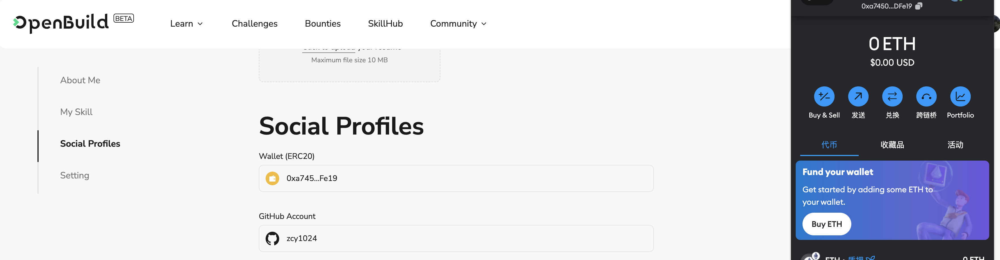

# Task2 Blockchain Basic

本任务分为简答题、分析题和选择题，以此为模板，在下方填写你的答案即可。

选择题，请在你选中的项目中，将 `[ ]` 改为 `[x]` 即可

## [单选题] 如果你莫名奇妙收到了一个 NFT，那么

- [ ] 天上掉米，我应该马上点开他的链接
- [x] 这可能是在对我进行诈骗！

## [单选题] 群里大哥给我发的网站，说能赚大米，我应该

- [ ] 赶紧冲啊，待会米被人抢了
- [x] 谨慎判断，不在不信任的网站链接钱包

## [单选题] 下列说法正确的是

- [x] 一个私钥对应一个地址
- [ ] 一个私钥对应多个地址
- [ ] 多个私钥对应一个地址
- [ ] 多个私钥对应多个地址

## [单选题] 下列哪个是以太坊虚拟机的简称

- [ ] CLR
- [x] EVM
- [ ] JVM

## [单选题] 以下哪个是以太坊上正确的地址格式？

- [ ] 1A4BHoT2sXFuHsyL6bnTcD1m6AP9C5uyT1
- [ ] TEEuMMSc6zPJD36gfjBAR2GmqT6Tu1Rcut
- [ ] 0x997fd71a4cf5d214009619808176b947aec122890a7fcee02e78e329596c94ba
- [x] 0xf39Fd6e51aad88F6F4ce6aB8827279cffFb92266

## [多选题] 有一天某个大哥说要按市场价的 80% 出油给你，有可能

- [x] 他在洗米
- [ ] 他良心发现
- [x] 要给我黒米
- [x] 给我下套呢

## [多选题] 以下哪些是以太坊的二层扩容方案？

- [ ] Lightning Network（闪电网络）
- [x] Optimsitic Rollup
- [x] Zk Rollup

## [简答题] 简述区块链的网络结构

```
区块链是一个公开的去中心化公共可信数据库，使用区块作为单位来存储数据，区块与区块之间串联，形成类似链表的形式，它们存储于全世界若干个节点当中，这些节点采用P2P的形式通讯，相互验证数据正确性，提供查询和改写入口，不正确的数据不会被承认，用户与区块链网络之间的交互，将以节点作为入口。
```

## [简答题] 智能合约是什么，有何作用？

```
智能合约是部署在区块链上的程序，可以被用户发起交易来调用，可以被开发者编写与部署。
通过智能合约，用户可以将数据保存到链上，同时也可以通过调用合约（交易）的方式来读取甚至是在权限内修改数据。
换句话说，智能合约可以看成是运行在远程服务器（web3公链）上的后端程序。
```

## [简答题] 怎么理解大家常说的 `EVM` 这个词汇？

```
EVM家族（以太坊为首的具有代表性的公链）所运行智能合约的虚拟机叫作EVM，采用去中心化的方式，提供一个可构建、执行代码等功能的环境。
```

## [分析题] 你对去中心化的理解

```
去中心化是一种通过分布式网络来实现数据存储、处理和传输的方式，而不依赖单一中心化的服务器或机构。去中心化的实现通常依赖于区块链技术或者其它分布式账本技术，具有安全、透明等特性。
```

## [分析题] 比较区块链与传统数据库，你的看法？

```
最鲜明的区别在于存储数据的方式，传统数据库会将数据存储在一起，然后对其进行增删改查，而区块链使用区块作为单位来存储数据，区块与区块之间串联，形成类似链表的形式，除此之外，区块链的数据存储于全世界若干个节点当中，这些节点采用P2P的形式通讯，相互验证数据正确性，提供查询和改写入口，一旦某一数据没有被公认，那它就不会被共识，增强了数据的安全性，也是其更为透明公开。
```

## 操作题

安装一个 WEB3 钱包，创建账户后与 [openbuild.xyz](https://openbuild.xyz/profile) 进行绑定，截图后文件命名为 `./bind-wallet.jpg`.


