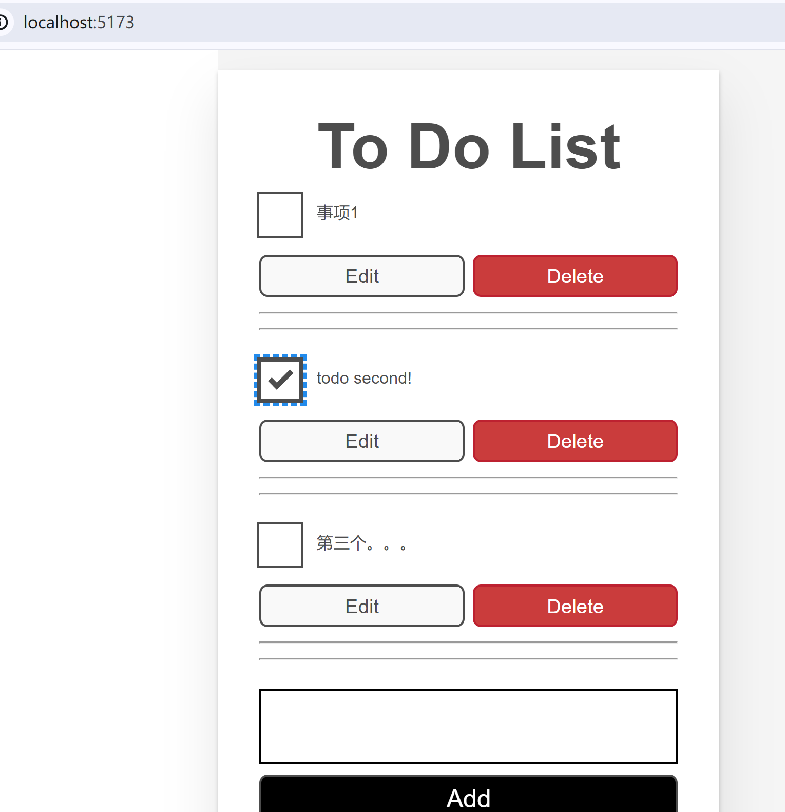

# to do list Reference material.

参考资料 1:

- https://developer.mozilla.org/zh-CN/docs/Learn/Tools_and_testing/Client-side_JavaScript_frameworks/React_todo_list_beginning

# 遗留问题:

在 App.tsx 中通过 "localStorage.getItem("tasks")" 读取的任务信息, 始终无法正常保存到 hook(tasks)，即 34 行 log 输出是空的。目前不太懂，忘老师指点.

# 效果截图

