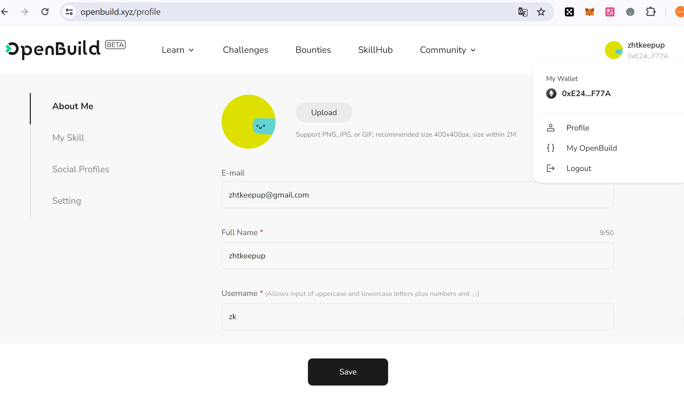

# Task2 Blockchain Basic

本任务分为简答题、分析题和选择题，以此为模板，在下方填写你的答案即可。

选择题，请在你选中的项目中，将 `[ ]` 改为 `[x]` 即可

## [单选题] 如果你莫名奇妙收到了一个 NFT，那么

- [ ] 天上掉米，我应该马上点开他的链接
- [x] 这可能是在对我进行诈骗！

## [单选题] 群里大哥给我发的网站，说能赚大米，我应该

- [ ] 赶紧冲啊，待会米被人抢了
- [x] 谨慎判断，不在不信任的网站链接钱包

## [单选题] 下列说法正确的是

- [x] 一个私钥对应一个地址
- [ ] 一个私钥对应多个地址
- [ ] 多个私钥对应一个地址
- [ ] 多个私钥对应多个地址

## [单选题] 下列哪个是以太坊虚拟机的简称

- [ ] CLR
- [x] EVM
- [ ] JVM

## [单选题] 以下哪个是以太坊上正确的地址格式？

- [ ] 1A4BHoT2sXFuHsyL6bnTcD1m6AP9C5uyT1
- [ ] TEEuMMSc6zPJD36gfjBAR2GmqT6Tu1Rcut
- [ ] 0x997fd71a4cf5d214009619808176b947aec122890a7fcee02e78e329596c94ba
- [x] 0xf39Fd6e51aad88F6F4ce6aB8827279cffFb92266

## [多选题] 有一天某个大哥说要按市场价的 80% 出油给你，有可能

- [x] 他在洗米
- [ ] 他良心发现
- [x] 要给我黒米
- [x] 给我下套呢

## [多选题] 以下哪些是以太坊的二层扩容方案？

- [ ] Lightning Network（闪电网络）
- [x] Optimsitic Rollup
- [x] Zk Rollup

## [简答题] 简述区块链的网络结构

```
区块链网络，是有去中心化的多个节点组成的，至少存在一个或多个“全功能”节点，全功能节点包含完整的交易数据，同时对新交易进行验证，同时争夺记账权并向区块链网络写入新的交易数据。\
同时也存在其他“提供查询与发起交易功能”的节点，提供RPC服务，我们的钱包客户端访问此类节点从网络查询账户信息，并且向区块链网络发起新交易。
```

## [简答题] 智能合约是什么，有何作用？

```
智能合约（smart contract）是部署在区块链网络上的程序，按照传统计算机系统的视角，相当于部署在一个虚拟机里的一个进程，针对EVM，关键区别在于：传统概念里，虚拟机可以重启，从而导致进程运行时状态全部是初始化，而EVM，是一个永不停机的环境，智能合约一旦部署，则没有“重新初始化”的概念，除非智能合约本身规则上的“重置”代码。“运行中的智能合约'进程'”不会主动发生状态变化，它接受EOA的访问或调用。
```

## [简答题] 怎么理解大家常说的 `EVM` 这个词汇？

```
EVM 指的是 以太坊虚拟机 (Ethereum Virtual Machine)，相当于JVM。
```

## [分析题] 你对去中心化的理解

```
没有中心化机构，链上数据一旦写入，无法撤销。每个用户对自己的数据拥有完全的控制权。
```

## [分析题] 比较区块链与传统数据库，你的看法？

```
1. 区块链只能物理追加，不可物理删除或修改。传统数据库可以物理删除或修改历史数据。
2. 区块链数据所有人都可以查询，传统数据库并非如此。
3. 区块链本身的查询统计功能比较弱，需要建设额外的链下数据库提供数据查询与统计的功能。

```

## 操作题

安装一个 WEB3 钱包，创建账户后与 [openbuild.xyz](https://openbuild.xyz/profile) 进行绑定，截图后文件命名为 `./bind-wallet.jpg`.

#### 操作题的截图如下


