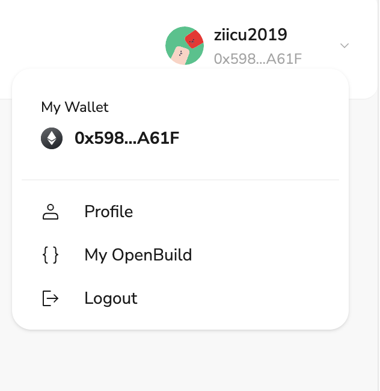

# Task2 Blockchain Basic

本任务分为简答题、分析题和选择题，以此为模板，在下方填写你的答案即可。

选择题，请在你选中的项目中，将 `[ ]` 改为 `[x]` 即可

## [单选题] 如果你莫名奇妙收到了一个 NFT，那么

- [ ] 天上掉米，我应该马上点开他的链接
- [x] 这可能是在对我进行诈骗！

## [单选题] 群里大哥给我发的网站，说能赚大米，我应该

- [ ] 赶紧冲啊，待会米被人抢了
- [x] 谨慎判断，不在不信任的网站链接钱包

## [单选题] 下列说法正确的是

- [x] 一个私钥对应一个地址
- [ ] 一个私钥对应多个地址
- [ ] 多个私钥对应一个地址
- [ ] 多个私钥对应多个地址

## [单选题] 下列哪个是以太坊虚拟机的简称

- [ ] CLR
- [x] EVM
- [ ] JVM

## [单选题] 以下哪个是以太坊上正确的地址格式？

- [ ] 1A4BHoT2sXFuHsyL6bnTcD1m6AP9C5uyT1
- [ ] TEEuMMSc6zPJD36gfjBAR2GmqT6Tu1Rcut
- [ ] 0x997fd71a4cf5d214009619808176b947aec122890a7fcee02e78e329596c94ba
- [x] 0xf39Fd6e51aad88F6F4ce6aB8827279cffFb92266

## [多选题] 有一天某个大哥说要按市场价的 80% 出油给你，有可能

- [x] 他在洗米
- [ ] 他良心发现
- [x] 要给我黒米
- [x] 给我下套呢

## [多选题] 以下哪些是以太坊的二层扩容方案？

- [ ] Lightning Network（闪电网络）
- [x] Optimsitic Rollup
- [x] Zk Rollup

## [简答题] 简述区块链的网络结构

```md
区块链的网络结构是一种去中心化、分布式的网络系统，它的核心特性包括去中心化、数据不可篡改和共识机制。以下是区块链网络结构的简要描述：

1. 节点（Nodes）
一个区块链网络一般由若干个节点构成，用户与区块链网络的交互以节点作为入口。

2. 共识机制（Consensus Mechanisms）
区块链网络中的节点彼之间相互广播数据，通过共识算法在自身验证数据判断正确性，不正确的数据不会被承认，常见的共识机制有：工作量证明（Proof of Work, PoW）、权益证明（Proof of Stake, PoS）等。

3. 分布式账本（Distributed Ledger）
每个节点都持有一份完整的账本副本，账本记录了所有的交易数据。数据以区块的形式存储，每个区块包含若干交易记录。

4. 区块（Blocks）
区块是数据的集合，每个区块包含多个交易。区块通过加密哈希值连接成链，每个区块包含上一个区块的哈希值，确保数据不可篡改。

5. 交易（Transactions）
交易是区块链上的基本操作，记录了资产的转移或状态的变化。交易在被打包进区块前，需要经过验证和签名。

6. P2P网络（Peer-to-Peer Network）
区块链网络是基于P2P协议，每个节点都可以与其他节点直接通信。这种结构消除了单点故障，提高了网络的健壮性和安全性。

通过这些结构和机制，区块链实现了去中心化的信任、安全的数据存储和透明的交易记录。
```

## [简答题] 智能合约是什么，有何作用？

```md
智能合约是一种在区块链上自动执行的协议，定义了一系列预设的规则和条件，当这些条件被满足时，合约的内容会自动执行。它们本质上是一段代码，存储在区块链上，并且在合约触发时运行。智能合约的目标是减少对中介的依赖、提高透明度、降低成本和提高交易效率。

他的主要特点和作用如下：

1. 自动化执行
智能合约在条件满足时会自动执行，无需人工干预。例如，A和B之间的支付合约可以设定为在A完成某项任务后，B自动支付报酬。

2. 去中心化
智能合约存储在区块链上，分布在整个网络中，不依赖于单一的服务器或中介机构。这减少了单点故障的风险。

3. 透明和不可篡改
合约的内容和执行记录存储在区块链上，任何人都可以查看，且一旦部署无法篡改。这提高了信任和透明度。

4. 安全性
由于区块链的加密特性，智能合约的执行是安全且可信的。合约代码在部署后不可更改，防止恶意篡改。

5. 高效性和成本节约
自动化执行减少了人工处理和中介的参与，从而提高了效率并降低了成本。
```

## [简答题] 怎么理解大家常说的 `EVM` 这个词汇？

```md
EVM作为以太坊的核心，提供了一个强大的计算平台，使智能合约能够在一个去中心化、安全且可信的环境中运行。通过Gas机制和图灵完备性，EVM不仅保证了系统的安全性和稳定性，还使得以太坊能够支持复杂的去中心化应用。

EVM有一下主要特点：
1. 图灵完备性
EVM是图灵完备的，这意味着它可以执行任意计算任务，只要有足够的资源（如计算时间和存储空间）。

2. 账户模型：
以太坊使用账户模型，包括外部账户（由私钥控制）和合约账户（由智能合约控制）。

3. Gas机制：
为了防止滥用资源，EVM使用Gas机制，每个操作都需要消耗一定量的Gas，Gas由以太坊（ETH）支付。这不仅防止了恶意行为，还鼓励高效的代码执行。

4. 字节码执行：
智能合约在以太坊上以字节码形式存储和执行，这些字节码由编译器从高级语言（如Solidity）编译而来。
```

## [分析题] 你对去中心化的理解

```
去中心化是一种改变传统集中化管理模式的新兴技术理念，具有安全、透明、抗审查和去中介化的优势。尽管在效率和治理方面面临挑战，但其在区块链、去中心化金融（DeFi）、分布式存储和去中心化自治组织（DAO）等领域的应用展示了巨大的潜力。未来，随着技术的进步和应用的扩展，去中心化将进一步推动各行业的创新和变革。
```

## [分析题] 比较区块链与传统数据库，你的看法？

```
区块链和传统数据库各有优劣，适用于不同的应用场景。区块链的优势在于去中心化、安全性、透明性和不可篡改性，适用于需要高度信任和安全的场景。而传统数据库在性能、效率和数据管理灵活性上更具优势，适合高频数据操作和实时性要求高的应用。根据具体需求选择合适的技术，可以充分发挥二者的优势。
```

## 操作题

安装一个 WEB3 钱包，创建账户后与 [openbuild.xyz](https://openbuild.xyz/profile) 进行绑定，截图后文件命名为 `./bind-wallet.jpg`.


